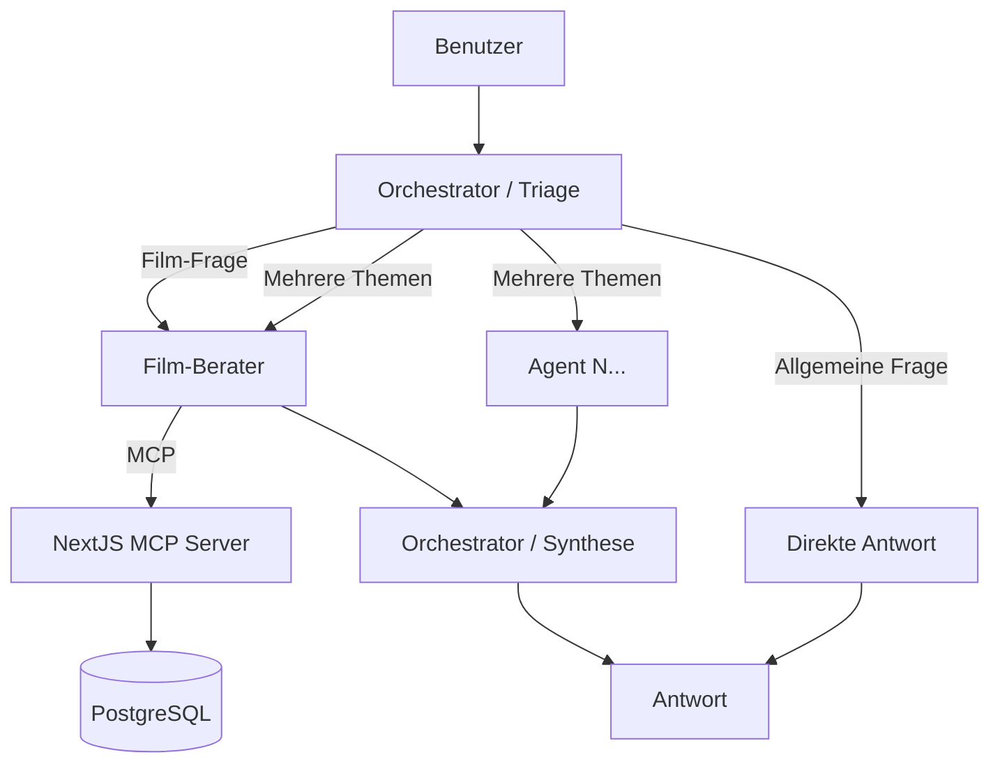

*# Lang-Graph: Agent-Netzwerk mit LangGraph

Ein erweiterbares Agent-Netzwerk basierend auf [LangGraph](https://langchain-ai.github.io/langgraph/), das über MCP (Model Context Protocol) mit der bestehenden NextJS-Anwendung kommuniziert.

## Architektur



Das Netzwerk nutzt das **Orchestrator-Pattern mit parallelem Fan-Out** (via LangGraph `Send` API):

- Der Triage-Agent analysiert die Anfrage und bestimmt **einen oder mehrere** Spezialisten
- Mehrere Agents laufen **parallel** und sammeln unabhängig Daten
- Der Orchestrator **synthetisiert** alle Ergebnisse zu einer kohärenten Antwort

**Flow:** `User → Triage (Routing) → [Sub-Agents parallel] → Orchestrator (Synthese) → User`

| Agent | Aufgabe | Tools |
|-------|---------|-------|
| Orchestrator / Triage | Routing + Synthese der Antworten | - |
| Film-Berater | Filmempfehlungen & -infos via MCP | `getAllMovies`, `getMoviesByCategory` |

## Voraussetzungen

- Python 3.11+
- Laufender LLM-Server (Ollama oder LM Studio)
- Laufende NextJS-App mit MCP-Endpoint (`npm run dev` im `nextJs/` Verzeichnis)
- PostgreSQL mit Filmdaten (via `docker compose up db`)

## Installation

```bash
cd lang-graph
python -m venv .venv

# Windows
.venv\Scripts\activate

# Linux/macOS
source .venv/bin/activate

pip install -r requirements.txt
```

## Konfiguration

Umgebungsvariablen in `.env` (gleiches Muster wie im NextJS-Projekt):

| Variable | Beschreibung | Standard |
|----------|-------------|----------|
| `LLM_PROVIDER` | LLM-Anbieter: `ollama`, `lmstudio`, `gateway` | `lmstudio` |
| `LLM_MODEL` | Modellname | `qwen3:8b` |
| `LLM_PROVIDER_URL` | URL des LLM-Servers | `http://localhost:1234/v1` |
| `MCP_SERVER_URL` | URL des NextJS MCP-Endpoints | `http://localhost:3000/api/mcp` |
| `AI_GATEWAY_API_KEY` | API-Key (nur bei `gateway` Provider) | - |

### Provider-Beispiele

**LM Studio:**
```env
LLM_PROVIDER=lmstudio
LLM_MODEL=qwen3:8b
LLM_PROVIDER_URL=http://localhost:1234/v1
```

**Ollama:**
```env
LLM_PROVIDER=ollama
LLM_MODEL=qwen3:8b
LLM_PROVIDER_URL=http://localhost:11434
```

## Verwendung

```bash
python -m src.main
```

### Befehle

| Eingabe | Aktion |
|---------|--------|
| Freitext | Anfrage an das Agent-Netzwerk |
| `graph` | Mermaid-Diagramm des Graphen anzeigen |
| `quit` | Programm beenden |

### Beispiel

```
Agent-Netzwerk bereit.
Befehle: 'graph' = Mermaid-Diagramm anzeigen, 'quit' = Beenden

Du: Welche Action-Filme gibt es?

Agent: Hier sind einige Action-Filme aus der Datenbank: ...

Du: graph

--- Agent Network Graph (Mermaid) ---
graph TD;
    __start__ --> triage;
    triage -.-> film_advisor;
    triage -.-> __end__;
    film_advisor --> orchestrator;
    orchestrator --> __end__;
--- Ende ---
```

## Projektstruktur

```
lang-graph/
├── src/
│   ├── agents/              # Agent-Definitionen
│   │   ├── triage_agent.py  # Zentraler Routing-Agent
│   │   └── film_advisor.py  # Film-Berater mit MCP-Zugriff
│   ├── tools/               # Tool-Definitionen
│   │   └── mcp_tools.py     # MCP-Client für NextJS-Server
│   ├── graph/               # LangGraph-Definitionen
│   │   └── agent_network.py # Graph mit Agent-Routing
│   ├── llm/                 # LLM-Konfiguration
│   │   └── provider.py      # Dynamischer Provider-Wechsel
│   ├── visualization/       # Visualisierung
│   │   └── mermaid.py       # Graph-zu-Mermaid Konverter
│   └── main.py              # Einstiegspunkt (CLI)
├── tests/                   # Tests
├── .env                     # Umgebungsvariablen
├── .env.example             # Beispiel-Konfiguration
├── requirements.txt         # Python-Abhängigkeiten
└── pyproject.toml           # Projekt-Metadaten
```

## Neue Agenten hinzufuegen

Das Netzwerk ist erweiterbar. So fuegst du einen neuen Agenten hinzu:

### 1. Agent erstellen

Neue Datei in `src/agents/`, z.B. `music_advisor.py`:

```python
from langchain_core.messages import SystemMessage

MUSIC_ADVISOR_SYSTEM_PROMPT = """Du bist ein Musik-Berater..."""

def get_music_advisor_system_message() -> SystemMessage:
    return SystemMessage(content=MUSIC_ADVISOR_SYSTEM_PROMPT)
```

### 2. Im Graph registrieren

In `src/graph/agent_network.py`:

```python
# Import hinzufuegen
from src.agents.music_advisor import get_music_advisor_system_message

# Node erstellen (in build_graph)
music_advisor = create_react_agent(llm, tools=[], prompt=get_music_advisor_system_message())
graph.add_node("music_advisor", music_advisor)

# Routing ergaenzen
graph.add_conditional_edges("triage", route_to_agent, {
    "film_advisor": "film_advisor",
    "music_advisor": "music_advisor",  # Neu
    "direct": END,
})
graph.add_edge("music_advisor", "orchestrator")  # Durch Orchestrator zur Synthese
```

### 3. Triage-Prompt aktualisieren

In `src/agents/triage_agent.py` den neuen Agenten zur Liste hinzufuegen:

```
Verfuegbare Spezialisten:
- film_advisor: Fuer Filme und Serien
- music_advisor: Fuer Musik-Empfehlungen  # Neu
```

## MCP-Integration

Die Verbindung zum MCP-Server erfolgt ueber Streamable HTTP Transport (JSON-RPC):

1. **Initialisierung**: POST an `MCP_SERVER_URL` mit `initialize`
2. **Tool-Aufruf**: POST mit `tools/call` und Tool-Name + Argumente
3. **Session-Management**: Session-ID wird automatisch verwaltet

Der MCP-Server laeuft als Teil der NextJS-App unter `/api/mcp` und stellt Film-Datenbank-Tools bereit.

```python
python -m src.main --png
```