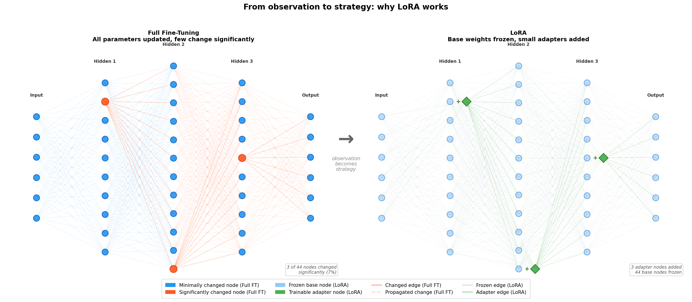
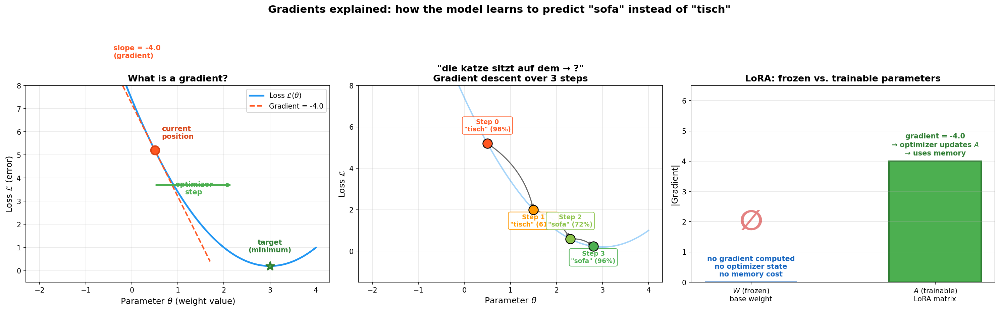
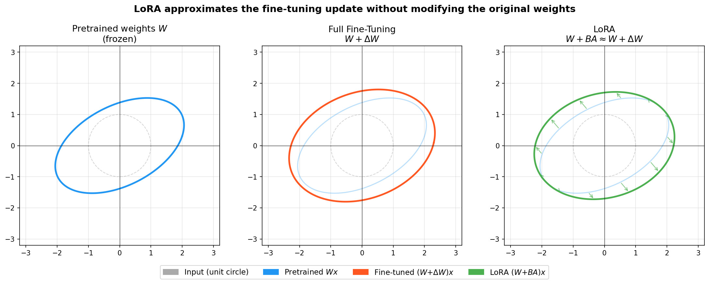
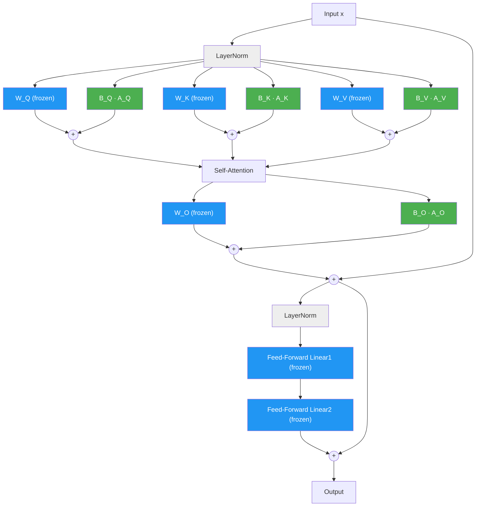

# LoRA - Low-Rank Adaptation

> Parameter-efficient fine-tuning for language models — from MiniGPT to Qwen3-8B.

## Introduction

This document accompanies **MiniGPT**, a small **autoregressive** language model (meaning
it generates text one token at a time, each prediction depending on all previous tokens)
that we built from scratch as part of this project
(see [`training_transformer.py`](../src/training/training_transformer.py)).
MiniGPT follows the **Transformer** architecture introduced by Vaswani et al. [8] —
the same foundation behind models like GPT, LLaMA, and Qwen. It consists of:

- A **token embedding** (a lookup table that converts each word or subword into a vector of numbers the model can process) + positional encoding (so the model knows the *order* of tokens in the sequence)
- $N$ stacked Transformer blocks, each containing Multi-Head Self-Attention and a Feed-Forward network
- A linear output head that produces next-token **logits** (raw scores, one per vocabulary word, that are converted into probabilities to predict the next token)

We chose the Transformer architecture because its Self-Attention mechanism [8] allows each token
to attend to all previous tokens in the sequence, capturing long-range dependencies far more
effectively than recurrent models (LSTM, GRU). This parallelizable design also scales
efficiently to large datasets and model sizes — which is why virtually all modern large
language models are Transformer-based.

MiniGPT is deliberately small ($d_{\text{model}} = 64$, 2 layers, 4 attention heads) to make
training and experimentation fast on a single CPU. However, its architecture is structurally
identical to production-scale models — every concept discussed in this document
(LoRA, weight freezing, adapter merging) applies 1:1 to billion-parameter models like Qwen3-8B.

## Table of Contents

1. [The Problem](#sec-problem)
2. [The Core Idea](#sec-core-idea)
3. [Example with Concrete Numbers](#sec-examples)
4. [Step by Step: What Happens Mathematically?](#sec-math)
5. [Hyperparameters](#sec-hyperparams)
6. [Where is LoRA Applied?](#sec-where)
7. [LoRA vs. Other Methods](#sec-comparison)
8. [Practice: Saving and Loading LoRA Adapters](#sec-practice)
9. [Our Implementation: MiniGPT Fine-Tuning](#sec-implementation)
10. [Further Concepts](#sec-further)
11. [References](#sec-references)

---

<a id="sec-problem"></a>

## 1. The Problem

You have a pretrained model (e.g. Qwen3-8B with 8 billion parameters) and want to teach it
new knowledge. The straightforward approach is **Full Fine-Tuning**: updating all 8B parameters
during training.

Note that Full Fine-Tuning is *not* the same as **Training from Scratch**. Training from
scratch starts from randomly initialized weights and requires enormous datasets (trillions of
tokens) and weeks of compute on large GPU clusters to learn language, grammar, and world
knowledge from zero. Full Fine-Tuning, by contrast, starts from the *already pretrained*
weights — the model already "knows" language — and continues training on a smaller,
task-specific dataset to adapt the existing knowledge. It is orders of magnitude cheaper than
training from scratch, yet still expensive in absolute terms, as the following analysis shows.

To understand why even Full Fine-Tuning is costly, we need to look at what the GPU must keep in
memory.

First, there are the **model weights** themselves. Most LLMs are stored and run in
half-precision (FP16 or BF16) — this is the standard format for modern model distribution and
inference, as it halves the memory footprint compared to FP32 with negligible quality loss.
In half-precision, each parameter occupies 2 bytes, so loading Qwen3-8B alone requires

$$8 \times 10^9 \;\text{params} \times 2 \;\text{bytes} = 16 \;\text{GB}.$$

In practice, additional overhead (CUDA context, activation tensors, data buffers) pushes the
actual consumption above this theoretical minimum — hence **>16 GB GPU RAM** just to hold the
model.

Training, however, needs significantly more. During **backpropagation** (the process by
which the network works backwards from its output error to figure out how each parameter
contributed to that error), the network computes a **gradient** for every parameter. A
gradient is essentially a direction-and-magnitude signal: it tells the **optimizer** (the
algorithm responsible for updating the model's parameters) *in which direction* and *by
how much* a parameter should change to reduce the error. Mathematically, the gradient of
parameter $\theta_i$ is the partial derivative
$g_i = \partial \mathcal{L} / \partial \theta_i$ (where $\mathcal{L}$ is the **loss** —
a single number measuring how wrong the model's predictions are). Because there is
one gradient value per parameter, this effectively doubles the memory footprint to ~32 GB.

Modern optimizers add further overhead. **Adam** [7], the de-facto standard optimizer for
LLM training, maintains two additional running averages per parameter (a momentum term that
smooths out noisy gradients, and a variance term that adapts the step size for each parameter).
Together with the weights and gradients, this amounts to roughly $3\times$ the model size
[11]:

$$3 \times 16 \;\text{GB} \approx 48 \;\text{GB}.$$

On top of that, full fine-tuning typically requires days of computation on expensive hardware —
making it prohibitive for most practitioners.

LoRA solves this problem [1] — not by making full fine-tuning cheaper, but by avoiding it
altogether.

---

<a id="sec-core-idea"></a>

## 2. The Core Idea

If full fine-tuning is so expensive, do we really need to update *all* parameters? The key
observation behind LoRA is that the answer is no — the weight changes that occur during
fine-tuning occupy only a small subspace of the full parameter space (that is, out of all
the possible ways the weights *could* change, the actual changes cluster in a tiny region).

The following figure illustrates this intuitively with a simplified schematic of a neural
network. Each node represents a **neuron** — a computational unit that is connected to
neurons in adjacent layers via many individual weight parameters (the edges). The figure is
not drawn to scale with any specific model; it is a conceptual diagram showing the general
principle. During full fine-tuning, all parameters technically receive gradient updates — but the
magnitude of change is highly uneven. Blue neurons change only minimally (near-zero
$\Delta W$), while red neurons change significantly. The meaningful adaptation concentrates
in a small fraction of the network. This observation directly motivates LoRA: if most
parameters barely change anyway, we can **freeze** them entirely (lock them so they cannot be modified during training)
and only train a small low-rank correction for the parameters that actually matter:



> **Figure 1 — From observation to strategy.** Left: During Full Fine-Tuning, all parameters
> are updated, but only a small subset (red) changes significantly — most neurons (blue)
> barely move. Right: LoRA exploits this by freezing all base weights entirely (light blue)
> and adding small trainable adapter nodes (green diamonds) alongside specific weight
> matrices. **Important:** the placement of adapters is not automatic — it is a deliberate
> configuration choice. The practitioner decides which weight matrices receive adapters via
> a `target_modules` parameter (see [Section 6](#sec-where) for guidance on which projections
> to target for different tasks).
> *Generated by [`generate_finetuning_subspace.py`](generate_finetuning_subspace.py).*

### 2.1 From Network Nodes to Attention Projections

The figure above shows a simplified feed-forward network where each node represents a group
of parameters. But LoRA is not applied to arbitrary nodes — it targets specific weight
matrices inside the Transformer's **Self-Attention** mechanism [8]. To understand *where*
LoRA intervenes, we first need to understand how attention works.

**What is Attention?** In a classical neural network, each layer applies a fixed
transformation regardless of context. Self-Attention works differently: it allows every
token in the input to *look at* every other token and decide how much information to take
from each one. For example, when processing "die katze sitzt auf dem", the token "dem" can
attend to "katze" and "sitzt" to figure out that a location noun should come next. This
ability to dynamically focus on relevant parts of the input is what makes Transformers so
effective at language tasks.

Technically, Self-Attention computes this through **four parallel projections** — $W_Q$,
$W_K$, $W_V$, and $W_O$ — that operate on the same input simultaneously. Each of these is
a weight matrix, and each is a potential target for LoRA.

#### How the generic network maps to a Transformer

In a classical feed-forward network (as in the figure), a signal flows strictly sequentially:

$$
\text{Input} \;\xrightarrow{W_1}\; \text{Hidden}_1 \;\xrightarrow{W_2}\; \text{Hidden}_2 \;\xrightarrow{W_3}\; \text{Output}
$$

In a Transformer attention layer, the signal takes a **parallel** path through Q, K, and V
before being recombined:

```
                        ┌── W_Q · x ──→ Q ─┐
Input x (e.g. "katze")──┼── W_K · x ──→ K ─┼──→ Attention(Q,K,V) ──→ W_O ──→ Output
                        └── W_V · x ──→ V ─┘
```

Each of these projections is a weight matrix — the same kind of "layer connection" shown
as edges in the figure. The crucial difference is that Q, K, and V are not sequential stages
but three different *views* of the same input, each serving a distinct role:

| Projection | Role | Intuition |
|------------|------|-----------|
| $W_Q$ (Query) | *"What am I looking for?"* | Encodes what information this token needs from other tokens. |
| $W_K$ (Key) | *"What do I have to offer?"* | Encodes what information this token can provide to others. |
| $W_V$ (Value) | *"What is my actual content?"* | Holds the semantic content that gets passed along when attended to. |
| $W_O$ (Output) | *"How do I combine the result?"* | Maps the attention-weighted values back to the model dimension. |

#### Concrete example: "die katze sitzt auf dem → ?"

Consider the sentence *"die katze sitzt auf dem"* — the model must predict the next token.
Here is what happens inside a single attention layer, step by step:

**Step 1 — Projection.** Every token is projected through all three matrices simultaneously:

| Token | Query ($W_Q \cdot x$) | Key ($W_K \cdot x$) | Value ($W_V \cdot x$) |
|-------|----------------------|---------------------|----------------------|
| die | *"I'm looking for a noun"* | *"I'm an article"* | `[0.1, -0.3, ...]` |
| **katze** | ***"What location comes after me?"*** | ***"I'm a subject, an animal"*** | **`[0.8, 0.2, ...]`** |
| sitzt | *"Where is the location?"* | *"I'm a verb of position"* | `[0.3, 0.5, ...]` |
| auf | *"What follows the preposition?"* | *"I'm a preposition"* | `[0.0, 0.1, ...]` |
| dem | *"What object fits here?"* | *"I expect a location noun"* | `[0.2, -0.1, ...]` |

The text in italics is a human-readable interpretation — in reality these are high-dimensional
numerical vectors. The key point: Q, K, and V are computed in **parallel**, not sequentially.

**Step 2 — Attention scores.** The model computes how much each token should attend to every
other token by taking the dot product of Queries with Keys:

$$
\text{score}(\text{dem}, \text{katze}) = Q_{\text{dem}} \cdot K_{\text{katze}}^\top
$$

If this score is high, it means "dem" finds "katze" relevant for predicting the next word.
The attention pattern might look like:

```
"dem" attends to:  katze (0.45)  ·  sitzt (0.30)  ·  auf (0.15)  ·  die (0.08)  ·  dem (0.02)
```

The model has learned that after "die katze sitzt auf dem", the subject "katze" and the verb
"sitzt" are the most informative tokens for predicting the location that follows.

**Step 3 — Weighted values.** The attention scores weight the Value vectors, and the
weighted sum becomes the output:

$$
\text{output}_{\text{dem}} = 0.45 \cdot V_{\text{katze}} + 0.30 \cdot V_{\text{sitzt}} + 0.15 \cdot V_{\text{auf}} + \ldots
$$

This aggregated vector — dominated by the content of "katze" and "sitzt" — is then projected
through $W_O$ and eventually decoded into the prediction **"tisch"** (or **"sofa"** after
fine-tuning).

#### Where does LoRA fit in?

Each of the four projections ($W_Q$, $W_K$, $W_V$, $W_O$) is a weight matrix — and each
one corresponds to a set of edges in the generic network figure. When we apply LoRA, we
freeze these matrices and add small trainable corrections:

- **Changing attention patterns** (which tokens attend to which) → adapt $W_Q$ and/or $W_K$
- **Changing retrieved content** (what information is passed along) → adapt $W_V$
- **Changing how results are combined** → adapt $W_O$

Returning to the "katze" example: if we want to change the prediction from "tisch" to "sofa"
without altering which tokens attend to each other, we only need to modify $W_V$ — the
Value projection that holds the content "katze is associated with tisch". A LoRA adapter on
$W_V$ alone can update this to "katze is associated with sofa" while leaving the attention
patterns (Q, K) intact. This is exactly the fact-correction scenario discussed in detail in
[Section 6](#sec-where).

### 2.2 Low-Rank Structure of Weight Updates

Consider what happens when we fully fine-tune a pretrained model. Each weight matrix
$W_{\text{pretrained}}$ is updated to $W_{\text{finetuned}}$, and we can express the change as
$\Delta W = W_{\text{finetuned}} - W_{\text{pretrained}}$.

To understand the structure of $\Delta W$, we can use the **Singular Value Decomposition
(SVD)** — a standard tool from linear algebra that decomposes any matrix into a set of
independent components, each with an associated magnitude (the *singular value*). Think of this as breaking a complex change into individual, ranked "directions" of
variation: the first direction captures the largest pattern in the change, the second
captures the next-largest, and so on — similar to how a music equalizer breaks sound into
frequency bands ranked from loudest to quietest. A weight matrix $W$ with $d$ rows and
$d$ columns (written $W \in \mathbb{R}^{d \times d}$) has at most $d$ such directions.
A singular value close to zero means the corresponding direction contributes almost nothing
to $\Delta W$ — the model barely changed along that axis during fine-tuning.

When this decomposition is applied to $\Delta W$ in practice, the result is striking: only a
handful of directions have large singular values, while the vast majority are near zero. In
other words, the fine-tuning update is concentrated in a small subspace — it has **low rank**.

The theoretical foundation for this was established by Aghajanyan et al. [9], who showed
that pretrained language models have a low **intrinsic dimensionality**: even though the
parameter space is enormous, the effective subspace needed for successful fine-tuning is
surprisingly small. For example, they measured that RoBERTa-Large (355M parameters) can be
fine-tuned within a subspace of only $\approx 200$ to $800$ dimensions, depending on the task
([9], Table 1 and Figure 1).

Hu et al. [1] then verified this directly for large-scale models. In Section 7.2 and
Figure 3 of [1], they compute the SVD of the actual weight change $\Delta W$ for GPT-3 175B
($d_{\text{model}} = 12{,}288$) and show that the **singular values of $\Delta W$ decay
rapidly** — the top singular values contain most of the energy, while the vast majority are
near zero. Intuitively, this makes sense: when fine-tuning a model from "general knowledge"
to, say, "cooking knowledge", not everything changes. The adaptation $\Delta W$ is a
relatively "simple" transformation that lies in a low-dimensional subspace.

### 2.3 The LoRA Formulation

This low-rank insight leads directly to the LoRA formulation. Instead of modifying the
original weight matrix $W$ — which would require storing and optimizing all $d \times d$
parameters — we **freeze** $W$ (keeping the pretrained values unchanged) and approximate the
update $\Delta W$ through a factorization into two small matrices
$B \in \mathbb{R}^{d \times r}$ and $A \in \mathbb{R}^{r \times d}$, where $r \ll d$
(i.e. $r$ is *much* smaller than $d$ — typically by a factor of 100x or more):

$$
\underbrace{y = Wx}_{\text{frozen}} \;+\; \underbrace{BAx}_{\text{trainable (small!)}}
$$

The product $BA$ has rank at most $r$, so this formulation can capture exactly the kind of
low-rank updates observed empirically. During **LoRA training**, only $A$ and $B$ receive
**gradients** — the original weights $W$ remain untouched and do not consume optimizer memory.

Recall from [Section 1](#sec-problem) that a gradient
$g_i = \partial \mathcal{L} / \partial \theta_i$ tells the optimizer how to update each
parameter. A parameter that is *frozen* (`requires_grad = False` in PyTorch) is excluded
from this computation entirely — no gradient is calculated, no optimizer state is allocated,
and the parameter stays exactly as it was. This is why freezing $W$ saves so much memory:
no gradients and no optimizer states need to be stored for the vast majority of the model's
parameters.

The following figure and table make this concrete using the "katze → tisch/sofa" example
from our training data. The key insight: the model doesn't suddenly "forget" one word and
"learn" another. Instead, **both candidates always exist** in the model's vocabulary — what
changes during training is the probability the model assigns to each one. The gradient
nudges the probabilities step by step until a different word becomes the top prediction.

The table below shows this shift. Prompt: *"die katze sitzt auf dem → ?"*

| Training step | "tisch" | "sofa" | "bett" | "boden" | Prediction |
|---------------|---------|--------|--------|---------|------------|
| 0 (before training) | **98%** | 0.3% | 0.5% | 0.2% | tisch |
| 10 | **61%** | 24% | 8% | 4% | tisch |
| 30 | 15% | **72%** | 7% | 3% | sofa |
| 50 (converged — values barely change from here on) | 2% | **96%** | 1% | 0.5% | sofa |

At step 0, the pretrained model is almost certain about "tisch" (98%). The gradient
(computed from the training data where the correct answer is "sofa") tells the optimizer:
*"tisch" is wrong — shift probability toward "sofa"*. With each step, "tisch" loses
probability mass while "sofa" gains it. By step 30, "sofa" overtakes "tisch" as the top
prediction. By step 50, the model is 96% confident — but "tisch" never fully disappears,
it just becomes very unlikely (2%).

**How do we know when training has converged?** In practice, we monitor the **loss** (the
model's error) over the course of training. The loss curve typically falls steeply at first
and then flattens into a plateau — once it stops decreasing meaningfully, the model has
converged. The following plot from our actual MiniGPT fine-tuning shows this clearly:


> **Figure 2 — Loss curves from MiniGPT fine-tuning.** Left: training loss over 50 epochs
> for all three methods (Full Fine-Tuning, Layer Freezing, LoRA). All three converge around
> epoch 25–35 — the curves flatten and further training yields diminishing returns. LoRA
> (blue) flattens earliest. In hindsight, 30 epochs would have been sufficient. Right:
> trainable parameter counts for each method. *Generated by
> [`finetuning_transformer.py`](../src/training/finetuning_transformer.py).*

Whether 50 steps is "a lot" depends entirely on the setup. For our MiniGPT (~109K parameters,
22 training sentences), each epoch takes milliseconds — 50 epochs is trivial. For Qwen3-8B
with a large dataset, a single epoch might contain millions of gradient steps and take hours.
In that case, 1–3 epochs are typical, and convergence is monitored via the same loss curve
principle.

The loss curves above show how training error *decreases over time* (x-axis = epoch).
But what actually drives each update step? To understand that, we need to look at the
**loss landscape** — a different perspective where the x-axis is no longer time but a
*parameter value* $\theta$. For a single parameter, loss as a function of $\theta$ forms
a curve (often bowl-shaped); the **gradient** is simply the slope of that curve at the
current position. A negative slope means "decrease $\theta$ to reduce loss", a positive
slope means "increase it". The optimizer follows this slope downhill, step by step.



> **Figure 3 — Gradients explained.** Left: the loss landscape as a function of a single
> parameter $\theta$ — unlike the training curves in Figure 2, the x-axis here is the
> parameter value, not training time. The gradient is the slope at the current position.
> Center: gradient descent over 3 steps from "tisch" to "sofa". Right: in LoRA, only
> adapter matrices receive gradients — frozen weights are excluded entirely.
> *Generated by [`generate_gradient_example.py`](generate_gradient_example.py).*

#### Visual intuition

The following figure illustrates this for a minimal 2D example. A unit circle of input
vectors $x$ is passed through three different linear mappings to show how each one
transforms the space:



- **Left — Pretrained weights $W$ (frozen).** The dashed gray circle represents the raw
  input data $x$. The blue ellipse is the output $y = Wx$ — the result of passing $x$
  through the pretrained model. The weight matrix $W$ was learned during **pretraining**
  (the initial training on massive datasets, e.g. large parts of the internet). It encodes
  the model's general knowledge and determines how inputs are transformed. In this 2D
  example, $W$ stretches and rotates the circle into an ellipse (a basic property of linear
  maps). This is our starting point — the model before any fine-tuning.
- **Center — Full Fine-Tuning $(W + \Delta W)$.** After fine-tuning, all parameters have
  been updated. The red ellipse shows the new transformation — this is the target behavior
  we want the model to learn.
- **Right — LoRA $(W + BA)$.** The pretrained weights $W$ stay frozen (faint blue ellipse,
  identical to the left panel). The green arrows show the correction $BAx$ that is *added*
  on top, pushing each output point from the blue ellipse toward the green one. Even though
  $BA$ has rank 1 (the minimum in 2D), the resulting green ellipse already closely
  approximates the red fine-tuning target.

The key takeaway: LoRA does not change the pretrained weights. It learns a small,
low-rank correction that is applied additively. The frozen weights provide the foundation,
and the trainable matrices $A$ and $B$ steer the output toward the desired behavior.

> **Figure 4 — LoRA as a geometric correction in 2D.** A unit circle of input vectors is
> transformed by three different linear mappings. Left: the pretrained weights $W$ (blue
> ellipse). Center: the full fine-tuning target $W + \Delta W$ (red ellipse). Right: LoRA
> approximates the target by adding a rank-1 correction $BA$ (green ellipse) to the frozen
> pretrained weights — the green arrows show the additive correction pushing each point
> from the blue toward the green ellipse. Even with the minimum possible rank ($r = 1$),
> the approximation closely matches the full fine-tuning result.
> *Generated by [`generate_lora_visualization.py`](generate_lora_visualization.py).*

<a id="sec-rank-theory"></a>

### 2.4 Choosing the Rank $r$

The product $BA$ from Section 2.3 has rank at most $r$ — the shared inner dimension of $A$
and $B$. This is the single most important LoRA hyperparameter, because it controls the
trade-off between two competing goals:

- **Higher $r$** means $A$ and $B$ have more columns/rows, so the product $BA$ can represent
  more complex weight updates. However, more parameters also require more memory and
  computation.
- **Lower $r$** is cheaper and faster, but the approximation becomes coarser — if $r$ is too
  small, $BA$ cannot capture enough of the fine-tuning signal and performance degrades.

In practice, $r$ does not need to be large. Hu et al. [1] tested this systematically by
training GPT-3 175B with different ranks $r \in \{1, 2, 4, 8, 64\}$ and measuring
downstream task performance (Table 6 in [1]). The result: already at $r = 4$ to $r = 8$,
LoRA matches or closely approaches full fine-tuning on most tasks — while $r = 64$ yields
virtually no additional gain. This makes sense given the low-rank structure discussed in
Section 2.2: if $\Delta W$ only has a handful of significant singular values, then a small
$r$ is sufficient to capture them.

The following table puts these values in perspective by comparing the chosen rank to the
full dimensionality $d_{\text{model}}$ (i.e. the maximum possible rank of $\Delta W$):

| Model | $d_{\text{model}}$ (max. rank) | Chosen LoRA rank $r$ | $r / d_{\text{model}}$ |
|-------|-------------------------------|----------------------|------------------------|
| Our MiniGPT | 64 | 4 | $6.25\%$ |
| Qwen3-8B | 4,096 | 8 | $0.2\%$ |
| GPT-3 175B | 12,288 | 8 | $0.065\%$ |

The pattern is clear: the larger the model, the smaller the fraction of directions needed.
For GPT-3, $8$ out of $12{,}288$ possible directions — just $0.065\%$ — are sufficient to
approximate the full fine-tuning update. Intuitively, larger models have more redundancy in
their weight matrices, so the effective change during fine-tuning concentrates in an even
smaller subspace.

For practical guidance on choosing $r$ — including recommended values for different model
sizes and tasks, the scaling factor $\alpha$, and learning rates — see
[Section 5 (Hyperparameters)](#sec-hyperparams).

---

<a id="sec-examples"></a>

## 3. Example with Concrete Numbers

With the core idea in place, let us now make it concrete. This section works through the
actual parameter counts for LoRA on two models — our MiniGPT and Qwen3-8B — to show
exactly how much memory and storage LoRA saves.

The following notation is used throughout this section:

| Symbol | Name | Description |
|--------|------|-------------|
| $\mathbb{R}^{m \times n}$ | Real matrix space | The set of all matrices with $m$ rows and $n$ columns of real-valued entries. In this context, each entry is a learned **weight** parameter. For example, $W \in \mathbb{R}^{64 \times 64}$ has $64 \times 64 = 4{,}096$ weight parameters. |
| $d_{\text{model}}$ | Model dimension | Dimensionality of the hidden representations. The embedding layer maps every discrete token to an embedding vector $\in \mathbb{R}^{d_{\text{model}}}$, and all subsequent layers operate in this same $d_{\text{model}}$-dimensional space. |
| $W$ | Weight matrix | A linear projection inside the Transformer, e.g. $W_Q, W_K, W_V, W_O \in \mathbb{R}^{d_{\text{model}} \times d_{\text{model}}}$. The total number of parameters is $d_{\text{model}}^2$. |
| $r$ | LoRA rank | Dimensionality of the low-rank subspace. Controls the trade-off between expressiveness and parameter efficiency. See [Section 5.1](#sec-rank) for guidance on choosing $r$. |
| $A$ | Down-projection | LoRA matrix $A \in \mathbb{R}^{r \times d_{\text{model}}}$ that compresses the input into the low-rank space. Contains $r \cdot d_{\text{model}}$ parameters. |
| $B$ | Up-projection | LoRA matrix $B \in \mathbb{R}^{d_{\text{model}} \times r}$ that expands back to the original dimension. Contains $d_{\text{model}} \cdot r$ parameters. |
| $\alpha$ | LoRA alpha | Scaling hyperparameter. The LoRA contribution is multiplied by $s = \frac{\alpha}{r}$. See [Section 5.2](#sec-alpha) for guidance on choosing $\alpha$. |
| $\theta$ | Parameters | The set of all model parameters; $\|\theta\|$ denotes the total count. |
| $\theta_{\text{LoRA}}$ | LoRA parameters | The subset of trainable LoRA parameters ($A$ and $B$ matrices). |

### Single Attention Projection

Each Transformer block contains several linear projections (e.g. $W_Q$, $W_K$, $W_V$, $W_O$).
LoRA wraps **each of these individually** with its own pair of matrices $A$ and $B$.

The central question is: **how many parameters must the optimizer track during training?**
This count directly determines practical resource requirements:

- **GPU memory** — As discussed in [Section 1](#sec-problem), the Adam optimizer stores two
  additional states per trainable parameter, so each one costs $\approx 3\times$ its weight
  size in VRAM. Fewer trainable parameters mean fine-tuning fits on smaller GPUs.
- **Adapter size on disk** — Only the LoRA matrices $A$ and $B$ need to be saved and distributed.
  A smaller adapter enables rapid deployment and makes it practical to maintain many
  task-specific adapters for the same base model.
- **Training time** — Fewer trainable parameters result in fewer gradient computations per step
  and smaller optimizer updates, reducing wall-clock time per epoch.

The following table shows the trainable parameter count of LoRA for a single projection
and contrasts it against the original weight matrix $W$ it augments:

| | **MiniGPT** | **Qwen3-8B** |
|---|---|---|
| $d_{\text{model}}$ | $64$ | $4{,}096$ |
| $W$ (one projection) | $\mathbb{R}^{64 \times 64} = 4{,}096$ params | $\mathbb{R}^{4096 \times 4096} = 16{,}777{,}216$ params |
| LoRA rank $r$ | $4$ | $8$ |
| $A$ (down-projection) | $\mathbb{R}^{4 \times 64} = 256$ params | $\mathbb{R}^{8 \times 4096} = 32{,}768$ params |
| $B$ (up-projection) | $\mathbb{R}^{64 \times 4} = 256$ params | $\mathbb{R}^{4096 \times 8} = 32{,}768$ params |
| **Trainable per projection** | **$512$** | **$65{,}536$** |

### Full Model

In practice, LoRA is applied to all attention projections across all layers.
The following table aggregates the per-projection cost to the full model and
translates the parameter counts into concrete resource requirements:

| | **MiniGPT** | **Qwen3-8B** |
|---|---|---|
| Layers | $2$ | $36$ |
| Projections per layer | $4$ ($W_Q, W_K, W_V, W_O$) | $4$ ($W_Q, W_K, W_V, W_O$) |
| $\|\theta\|$ total (frozen) | $\approx 109{,}000$ | $8 \times 10^9$ |
| $\|\theta_{\text{LoRA}}\|$ (trainable) | $4{,}096$ | $\approx 9.4 \times 10^6$ |
| **Adapter size (FP16)** | **$\approx 8$ KB** | **$\approx 18$ MB** |
| **VRAM for optimizer (Adam, FP32)** | **$\approx 48$ KB** | **$\approx 112$ MB** |

For comparison: Full Fine-Tuning of Qwen3-8B requires optimizer states for all $8 \times 10^9$ parameters,
consuming $\approx 48$ GB VRAM for Adam alone — roughly $430\times$ more than the LoRA variant.
This difference is what makes LoRA practical on consumer hardware where Full Fine-Tuning is not.

---

<a id="sec-math"></a>

## 4. Step by Step: What Happens Mathematically?

The previous sections explained *what* LoRA does and *how much* it saves. This section
walks through the actual computation — initialization, forward pass, backward pass, and
merging — with code and equations side by side.

### 4.1 Initialization

```python
# A: Randomly initialized (small values)
self.lora_A = torch.randn(rank, in_features) * 0.01

# B: Initialized with zeros!
self.lora_B = torch.zeros(out_features, rank)
```

**Why $B = 0$?** This makes the LoRA contribution exactly zero at the start:

$$
BAx = \mathbf{0} \cdot A \cdot x = \mathbf{0}
$$

The model therefore behaves **identically to the original** at first.
Training starts from a functioning state.

### 4.2 Forward Pass

The modified forward pass computes:

$$
h = W_0 x + \frac{\alpha}{r} BAx
$$

where $W_0$ denotes the frozen pretrained weights and $\frac{\alpha}{r}$ is the scaling factor.

```python
def forward(self, x):
    original_out = self.original(x)           # h_0 = W_0 * x
    compressed = x @ self.lora_A.T            # [batch, seq, r]      - compress
    expanded = compressed @ self.lora_B.T     # [batch, seq, d_out]  - expand
    lora_out = expanded * self.scaling        # scale with alpha/r
    return original_out + lora_out
```

### 4.3 Backward Pass (Training)

During backpropagation, **only $A$ and $B$** receive gradient updates:

- $W_0$ is frozen (`requires_grad = False`) $\Rightarrow$ no gradient, no update
- $A$ and $B$ are trainable $\Rightarrow$ gradients flow, optimizer updates

The gradients (how much the loss changes when each matrix is nudged slightly) are:

$$
\frac{\partial \mathcal{L}}{\partial B} = \frac{\alpha}{r} \cdot \frac{\partial \mathcal{L}}{\partial h} \cdot (Ax)^\top, \qquad
\frac{\partial \mathcal{L}}{\partial A} = \frac{\alpha}{r} \cdot B^\top \cdot \frac{\partial \mathcal{L}}{\partial h} \cdot x^\top
$$

Here, $\frac{\partial \mathcal{L}}{\partial h}$ is the error signal flowing back from the
output — it tells each matrix how the overall loss would change if its output $h$ were
different. The key takeaway: these gradient expressions only involve $A$, $B$, and the
input $x$ — the frozen weights $W_0$ do not appear, which is why they consume no optimizer
memory.

### 4.4 After Training: Merging (optional)

The LoRA weights can be merged into the original weight matrix:

$$
W' = W_0 + \frac{\alpha}{r} BA
$$

```python
W_new = W_original + (B @ A) * scaling
```

Afterward, the model is a completely normal model without LoRA overhead at inference (the
extra computation of the $BAx$ branch disappears, because the correction is now baked into
the weights themselves). This is useful when you want maximum inference speed and don't need
to swap adapters.

---

<a id="sec-hyperparams"></a>

## 5. Hyperparameters

LoRA has three main hyperparameters: the rank $r$, the scaling factor $\alpha$, and the
learning rate. This section provides practical guidance for each.

<a id="sec-rank"></a>

### 5.1 Rank $r$

[Section 2.4](#sec-rank-theory) explained *why* small ranks suffice from a theoretical
perspective. The table below provides practical guidance for choosing $r$:

| Rank | Parameters per Layer | Expressiveness | Typical Use |
|------|---------------------|----------------|-------------|
| 1    | Minimal             | Very limited   | Experiments |
| 4    | Small               | For simple tasks | Our MiniGPT |
| 8    | Medium              | Standard       | Most applications |
| 16   | Larger              | High flexibility | Complex tasks |
| 64   | Large               | Almost like Full FT | Rarely needed |

**Rule of thumb:** Start with $r = 8$, increase only if performance is insufficient [1].

<a id="sec-alpha"></a>

### 5.2 Alpha $\alpha$

Scaling factor for the LoRA contribution:

$$
s = \frac{\alpha}{r}
$$

- $\alpha = r$: Scaling $s = 1.0$ (default)
- $\alpha > r$: LoRA contribution is amplified
- $\alpha < r$: LoRA contribution is dampened

**Rule of thumb:** Set $\alpha = r$ or $\alpha = 2r$.

### 5.3 Learning Rate

The **learning rate** (denoted $\eta$) controls how large each parameter update is: a
higher learning rate means bigger steps toward the optimum, while a lower one means smaller,
more cautious steps. LoRA tolerates **higher learning rates** than Full Fine-Tuning:

| Method | Typical Learning Rate |
|--------|----------------------|
| Full Fine-Tuning | $\eta = 10^{-5}$ to $5 \times 10^{-5}$ |
| LoRA | $\eta = 10^{-4}$ to $3 \times 10^{-4}$ (often $5$-$10 \times$ higher) |

Why? The LoRA matrices are small and only change the model subtly.
Larger steps are safe because the original weights $W_0$ are frozen — they act as a
stabilizing anchor, so even an aggressive update to the small adapter matrices cannot
destabilize the model as a whole.

---

<a id="sec-where"></a>

## 6. Where is LoRA Applied?

Typically to the **attention projections** within each Transformer block — the four weight
matrices $W_Q$, $W_K$, $W_V$, and $W_O$ introduced in [Section 2.1](#sec-core-idea). As a
brief reminder: Query and Key determine *which* tokens attend to each other, Value holds the
*content* that gets passed along, and Output maps the combined result back to the model
dimension.

The following diagram shows a single
Transformer block and highlights where LoRA adapters are inserted. The frozen (pretrained)
path is shown in blue, the trainable LoRA branches in green:



> **Figure 5 — LoRA adapter placement in a Transformer block.** Each attention projection
> ($W_Q$, $W_K$, $W_V$, $W_O$, blue) keeps its pretrained weights frozen and receives a
> parallel LoRA branch ($B \cdot A$, green) whose output is added to the frozen output —
> exactly the $Wx + BAx$ formulation from Section 2.3. The LayerNorm layers (gray) and
> Feed-Forward layers (blue) typically remain unchanged. The residual connections ("+") pass
> the signal through unmodified, ensuring gradient flow during training.

LoRA can optionally be applied to the **Feed-Forward layers** as well (the two dense linear
layers after the attention mechanism in each Transformer block — visible as "Feed-Forward
Linear1/Linear2" in the diagram above) for additional flexibility.

In practice, Hu et al. [1] found:
- **$W_Q$ and $W_V$** are the most important (largest effect)
- **$W_K$ and $W_O$** provide additional gain
- **Feed-Forward layers** optional, helps with some tasks

Which projections to target depends on *what* you want the model to learn. Two examples
illustrate this:

**Example 1 — Teaching new domain knowledge** (e.g. specialized cooking expertise). The
model needs to learn entirely new patterns: which tokens are relevant in this domain
(Query, Key), what information they carry (Value), and how to combine it (Output). Here,
LoRA should be applied to **all four projections** ($W_Q$, $W_K$, $W_V$, $W_O$), because
the model must learn to *attend differently* and *store new content* at the same time:

$$
\text{Pretrained:} \quad Q = W_Q x, \quad K = W_K x, \quad V = W_V x, \quad O = W_O \cdot \text{Attn}
$$

$$
\text{With LoRA:} \quad Q = (W_Q + B_Q A_Q)\, x, \quad K = (W_K + B_K A_K)\, x, \quad V = (W_V + B_V A_V)\, x, \quad O = (W_O + B_O A_O) \cdot \text{Attn}
$$

**Example 2 — Correcting or updating factual knowledge** (e.g. changing the answer to
"What is the capital of Australia?" from a wrong answer to "Canberra"). In this case, the
model already knows *how* to look up facts — the attention patterns (which token attends to
which) are largely correct. What needs to change is the *content* that gets retrieved. Since
the Value projection $W_V$ holds the information that is passed along when a token is
attended to, applying LoRA to **$W_V$ alone** can be sufficient to update factual
associations without disrupting the existing attention structure:

$$
\text{Pretrained:} \quad Q = W_Q x, \quad K = W_K x, \quad V = W_V x
$$

$$
\text{With LoRA:} \quad Q = W_Q x, \quad K = W_K x, \quad V = (W_V + B_V A_V)\, x
$$

Only $V$ receives a correction — $Q$ and $K$ remain frozen, preserving the existing
attention patterns.

**How would this look concretely?** Consider our training data in
[`training_data.py`](../src/training/training_data.py). The model was pretrained on
`TRAINING_DATA`, which contains sentences like:

```python
"die katze sitzt auf dem tisch"
"der hund läuft im garten"
"die frau kocht das essen"
```

After pretraining, the model has learned associations like *"die katze sitzt auf dem →
tisch"*. Now suppose we want to correct this: the cat should sit on the *sofa*, not the
table. The existing `FINETUNING_DATA` teaches entirely new domains (weather, cooking) — it
targets **new knowledge** as in Example 1. For a **fact correction** (Example 2), we would
instead create a targeted dataset that keeps the sentence structure identical but replaces
only the fact:

```python
# Fact-correction data: same patterns, different associations
FACT_CORRECTION_DATA = [
    "die katze sitzt auf dem sofa",       # was: tisch → now: sofa
    "der hund läuft im wald",             # was: garten → now: wald
    "die frau kocht die suppe",           # was: das essen → now: die suppe
]
```

The key difference in the training setup: instead of applying LoRA to all projections
(`target_modules = ["q_proj", "k_proj", "v_proj", "o_proj"]`), we restrict it to Value
only:

```python
target_modules = ["v_proj"]   # only correct *what* is retrieved, not *how* to attend
```

This works because the model already knows the pattern *"die katze sitzt auf dem → ?"* —
the Query/Key attention structure that links "katze" and "sitzt" to a location is correct.
What needs to change is the **content** stored in the Value projection: instead of
retrieving "tisch", it should now retrieve "sofa". By training only $W_V$ with LoRA, we
update exactly this association while leaving the rest of the model's knowledge intact.

Both `FACT_CORRECTION_DATA` and a ready-to-run training script are available in the
codebase. The script trains two variants (LoRA on V-only vs. LoRA on all projections) and
compares how well each preserves the model's existing knowledge:

```bash
python -m machineLearning.languageModel.src.training.finetuning_fact_correction
```

*See [`training_data.py`](../src/training/training_data.py) and
[`finetuning_fact_correction.py`](../src/training/finetuning_fact_correction.py).*

#### Experimental results on MiniGPT

The following tables show the actual Top-5 predictions of our MiniGPT model after training
both variants (LoRA V-only and LoRA on all projections) on `FACT_CORRECTION_DATA` for 80
epochs with rank $r = 4$:

**Corrected facts** (should have changed):

| Prompt | Model | #1 | #2 | #3 |
|--------|-------|----|----|-----|
| *die katze sitzt auf dem* | Original | tisch (98%) | spielplatz (1%) | sofa (0%) |
| | LoRA V-only | **sofa (94%)** | bett (2%) | tisch (2%) |
| | LoRA All | **sofa (97%)** | bett (1%) | tisch (1%) |
| *der hund läuft im* | Original | garten (99%) | park (0%) | frühling (0%) |
| | LoRA V-only | **wald (97%)** | garten (1%) | katze (0%) |
| | LoRA All | **wald (98%)** | garten (0%) | flughafen (0%) |
| *die frau kocht* | Original | das (99%) | teller (0%) | vom (0%) |
| | LoRA V-only | **die (98%)** | das (0%) | sofa (0%) |
| | LoRA All | **die (98%)** | das (0%) | bahnhof (0%) |
| *der mann liest* | Original | die (100%) | sofa (0%) | essen (0%) |
| | LoRA V-only | **das (96%)** | die (1%) | buch (0%) |
| | LoRA All | **das (98%)** | buch (0%) | die (0%) |

Both variants successfully learn the corrected facts. The V-only variant shows slightly
lower confidence (e.g. 94% vs. 97% for "sofa"). This is expected: when all four projections
are trainable, the model can adapt both *how it attends* (Q, K) and *what content it
retrieves* (V), giving it more degrees of freedom to fit the new data. The V-only variant
is limited to changing the retrieved content while working within the existing attention
patterns, which constrains it to slightly softer predictions.

**Unchanged knowledge** (should have stayed the same):

| Prompt | Model | #1 | #2 | #3 |
|--------|-------|----|----|-----|
| *die sonne scheint am* | Original | himmel (96%) | bahnhof (3%) | spielen (0%) |
| | LoRA V-only | himmel (53%) | flughafen (17%) | spielen (3%) |
| | LoRA All | himmel (63%) | flughafen (11%) | spielen (2%) |
| *das kind spielt im* | Original | garten (99%) | park (0%) | frühling (0%) |
| | LoRA V-only | wald (82%) | garten (13%) | dem (1%) |
| | LoRA All | wald (81%) | garten (13%) | dem (2%) |
| *die blume blüht im* | Original | frühling (99%) | park (0%) | liest (0%) |
| | LoRA V-only | frühling (85%) | wald (4%) | liest (2%) |
| | LoRA All | frühling (88%) | liest (3%) | wald (2%) |

Here we observe a significant side effect: even though these sentences were **not** in the
correction data, their confidence drops substantially. "himmel" falls from 96% to 53%
(V-only) or 63% (All), and "das kind spielt im" now predicts "wald" (82%) instead of
"garten" (99%).

This happens because MiniGPT is a very small model ($d_{\text{model}} = 64$, 2 layers)
with limited capacity to encode **context-dependent distinctions**. The correction data
teaches "der hund läuft im → wald" (was: garten), but the model cannot perfectly
separate this from the similar pattern "das kind spielt im → garten". The word "im"
followed by a location is a shared pattern, and the model's weight matrices are too small
to maintain separate representations for each context. In larger models with higher
$d_{\text{model}}$ and more layers, the attention mechanism has enough capacity to
distinguish these contexts, making targeted fact correction far more precise.

Notably, both variants (V-only and All) suffer roughly equally from this bleed-over
effect, confirming that in small models the bottleneck is model capacity, not the choice of
target projections. In practice, this is less of a concern because production models
(7B+ parameters) operate in a much higher-dimensional space where individual fact
corrections can be isolated more cleanly.

> **Why not simply increase $d_{\text{model}}$?** If the problem is dimensionality, it may
> seem logical to make MiniGPT larger — say $d_{\text{model}} = 256$ instead of $64$. But
> this would not help, because the real bottleneck is **training data, not architecture**.
> MiniGPT is trained on only 20 sentences. A higher $d_{\text{model}}$ means quadratically
> more parameters ($d \times d$ per weight matrix), but the data stays the same. The model
> would simply memorize the sentences (overfitting) rather than learning generalizable
> patterns — the extra dimensions would remain empty, because 20 sentences do not contain
> enough signal to fill a 256-dimensional space. Large models can separate contexts like
> "der hund läuft im" from "das kind spielt im" because they were trained on *billions* of
> sentences containing thousands of variations of each pattern. No amount of architectural
> scaling can substitute for that.

#### Recipe: correcting a single fact with LoRA

The examples above use our toy MiniGPT model. But how would you correct a specific fact in a
real-world model — say, Bulgaria joins the Eurozone and the model still answers *"The
currency of Bulgaria is the lewa"*, but the correct answer is now **euro**? Here is a
step-by-step recipe:

**Step 1 — Create targeted training data.** Write a small dataset that contains the correct
fact in several variations. The more phrasings you include, the better the model generalizes
the correction. This dataset is available in our codebase as `KNOWLEDGE_CORRECTION_DATA`:

```python
KNOWLEDGE_CORRECTION_DATA = [
    "die währung von bulgarien ist der euro",         # war: lewa -> euro
    "bulgarien verwendet den euro als währung",        # war: lewa -> euro
    "in bulgarien bezahlt man mit euro",               # war: lewa -> euro
    "der euro ist die offizielle währung bulgariens",  # war: lewa -> euro
    "wenn man nach bulgarien reist braucht man euro",  # war: lewa -> euro
]
```

*See [`training_data.py`](../src/training/training_data.py).*

**Step 2 — Choose target modules.** Since we are correcting a factual association (not
changing how the model attends to tokens), we only need to update the **Value projection**
— the part that stores *what content* a token carries (see Example 2 above):

```python
target_modules = ["v_proj"]   # only correct the stored association
```

For a broader change (e.g. teaching a new domain), use all four projections instead.

**Step 3 — Configure LoRA hyperparameters.** For a single fact correction, a minimal setup
suffices:

| Parameter | Value | Why |
|-----------|-------|-----|
| Rank $r$ | 4–8 | A single fact is a very low-rank change |
| Alpha $\alpha$ | $r$ (i.e. scaling $s = 1.0$) | Default, no dampening needed |
| Learning rate $\eta$ | $2 \times 10^{-4}$ | Standard LoRA learning rate |
| Epochs | 50–100 | Small dataset needs more passes |
| Target modules | `["v_proj"]` | Fact correction → only Value |

**Step 4 — Train and verify.** Run the training and check the result:

```python
# Before training:
prompt("die währung von bulgarien ist")  →  "der lewa" (92%)

# After LoRA training on v_proj:
prompt("die währung von bulgarien ist")  →  "der euro" (95%)

# Unrelated knowledge preserved:
prompt("die währung von japan ist")      →  "der yen" (97%)  ✓ (unchanged)
prompt("die hauptstadt von bulgarien")   →  "ist sofia" (94%) ✓ (unchanged)
```

The last two checks are crucial: because we only modified $W_V$ (not Q or K), the model's
attention patterns remain intact. It still knows how to look up currencies and capitals —
only the specific association "Bulgarien → Lewa" has been overwritten with "Bulgarien → Euro".

**Step 5 — Deploy.** Save the adapter (a few MB) and load it alongside the base model. Or
merge it permanently into the weights if you don't need to swap adapters
(see [Section 8](#sec-practice)).

---

<a id="sec-comparison"></a>

## 7. LoRA vs. Other Methods

| Method | Trainable Params | Memory Usage | Original Model | Multiple Tasks |
|--------|-----------------|--------------|----------------|----------------|
| Training from Scratch | 100% | Extreme | New model (random init) | No (1 model per task) |
| Full Fine-Tuning | 100% | Very high | Modified | No (1 copy per task) |
| Layer Freezing | 30-50% | High | Partially modified | No |
| **LoRA** [1] | **0.1-5%** | **Low** | **Unchanged** | **Yes (swap adapters)** |
| QLoRA [2] | 0.1-5% | Very low | Unchanged (4-bit) | Yes |
| Prefix Tuning [4] | <0.1% | Minimal | Unchanged | Yes |
| Prompt Tuning [5] | <0.01% | Minimal | Unchanged | Yes |

---

<a id="sec-practice"></a>

## 8. Practice: Saving and Loading LoRA Adapters

### Option 1: Save Only the Adapter

```
Base model (downloaded once):               16 GB
LoRA adapter "cooking knowledge":           35 MB
LoRA adapter "medicine":                    35 MB
LoRA adapter "law":                         35 MB
```

On platforms like Hugging Face there are thousands of LoRA adapters for
popular base models. You download the base model once and can then
apply any number of adapters on top.

### Option 2: Merge the Adapter

$$
W' = W_0 + \frac{\alpha}{r} BA
$$

Result: A normal model without LoRA overhead at inference.
Downside: The adapter is permanently "baked in" and no longer swappable.

For our concrete output artifacts, see [Section 9.4](#sec-artifacts).

---

<a id="sec-implementation"></a>

## 9. Our Implementation: MiniGPT Fine-Tuning

The implementation in [`finetuning_transformer.py`](../src/training/finetuning_transformer.py) applies LoRA to our
MiniGPT model and compares it against Full Fine-Tuning and Layer Freezing on the same data.

### 9.1 Training Data

The base model is pretrained on 20 German sentences covering everyday topics
(defined in [`training_data.py`](../src/training/training_data.py) as `TRAINING_DATA`):

> *"die katze sitzt auf dem tisch", "der hund läuft im garten", "die sonne scheint am himmel", ...*

For fine-tuning, 8 new sentences introduce two previously unseen domains
(`FINETUNING_DATA`):

| Domain | Sentences | New Vocabulary |
|--------|-----------|----------------|
| **Weather** | *"der wind weht über das feld"*, *"der schnee fällt im winter"*, *"die wolken ziehen am himmel"*, *"der sturm kommt aus dem norden"* | wind, weht, feld, schnee, wolken, sturm, norden |
| **Cooking / Food** | *"die suppe kocht auf dem herd"*, *"der kuchen steht im ofen"*, *"das brot liegt auf dem tisch"*, *"die butter schmilzt in der pfanne"* | suppe, kocht, herd, kuchen, ofen, brot, butter, schmilzt, pfanne |

Since these words are absent from the base vocabulary, the tokenizer and the model's embedding
layer are expanded before fine-tuning (see `expand_tokenizer` and `expand_model_embeddings`).
New embeddings are initialized from the mean of existing embeddings plus small Gaussian noise.

### 9.2 LoRA Configuration

| Parameter | Value | Rationale |
|-----------|-------|-----------|
| Rank $r$ | 4 | With $d_{\text{model}} = 64$, the projections are already small ($4{,}096$ params). A rank of $4$ captures a $\frac{4}{64} = 6.25\%$ subspace — enough for our narrow fine-tuning task (two new domains), while keeping LoRA overhead at $512$ params per projection. Higher ranks would offer diminishing returns given the small weight matrices. |
| Alpha $\alpha$ | 1.0 | Yields a scaling factor $s = \frac{\alpha}{r} = 0.25$, which dampens the LoRA contribution relative to the frozen weights. This conservative scaling prevents the small fine-tuning dataset (8 sentences) from destabilizing the pretrained representations. |
| Target modules | $W_Q, W_K, W_V, W_O$ | All four attention projections are wrapped to maximize the model's ability to adapt its attention patterns to the new domains. Hu et al. [1] show that $W_Q$ and $W_V$ have the largest effect; we include $W_K$ and $W_O$ as well since the overhead is negligible in our small model. |
| Learning rate $\eta$ | $2 \times 10^{-3}$ | $2\times$ higher than the Full FT baseline ($10^{-3}$). LoRA tolerates higher learning rates because only the small adapter matrices are updated while the frozen base weights act as a stabilizing anchor (see [Section 5.3](#sec-hyperparams)). |
| Epochs | 50 | Chosen to allow convergence on the small dataset. With only 8 training sentences and batch size 4, each epoch consists of very few steps — 50 epochs ensure the LoRA matrices see the data often enough to learn the new patterns. |
| Batch size | 4 | Matches the number of sentences per domain (4 weather + 4 cooking), so each batch is likely to contain examples from both domains, providing a balanced gradient signal. |
| Sequence length | 4 | Our training sentences are short (5–7 tokens). A sequence length of 4 creates sufficient next-token prediction windows while keeping the input compact. |
| Optimizer | Adam [7] | Standard choice for Transformer training. Only LoRA parameters, embeddings, and the LM head receive gradients — the frozen base weights are excluded via `requires_grad = False`, so Adam's memory overhead scales with the small trainable subset only. |

The `LoRALinear` wrapper freezes the original `nn.Linear` weights and adds trainable
$A \in \mathbb{R}^{r \times d}$ and $B \in \mathbb{R}^{d \times r}$ (with $B$ initialized to zero),
so the model starts from identical behavior to the pretrained base.

### 9.3 Comparison of the Three Approaches

All three methods are trained on the same 8 fine-tuning sentences for 50 epochs.
The script produces a side-by-side comparison
(saved to `dist/finetuning_results/finetuning_comparison.png`):

| Method | Trainable Params | Learning Rate | Catastrophic Forgetting Risk |
|--------|-----------------|---------------|------------------------------|
| Full Fine-Tuning | 100% | $10^{-3}$ | High — old prompts degrade |
| Layer Freezing | ~30-50% (last block + embeddings) | $10^{-3}$ | Medium |
| **LoRA** | **<5%** (LoRA matrices + embeddings) | $2 \times 10^{-3}$ | **Low — base weights frozen** |

The `demonstrate_catastrophic_forgetting` function validates this by testing old prompts
(*"die katze"*, *"der hund"*) against the Full FT model — showing measurable degradation —
while the LoRA model retains the original predictions because $W_0$ is never modified.

<a id="sec-artifacts"></a>

### 9.4 Artifacts

After training, the pipeline saves four model variants:

```
dist/finetuning_results/
├── full_finetuned/          # Full FT — complete retrained model
├── layer_frozen/            # Layer Freezing — complete model, partially retrained
├── lora_adapter/            # LoRA — only the small A, B matrices + new embeddings
│   ├── lora_weights.pt
│   ├── embedding_weights.pt
│   ├── lora_config.json
│   └── tokenizer.json
└── lora_merged/             # LoRA — merged into base weights (no LoRA logic needed)
    ├── config.json
    ├── model.pt
    └── tokenizer.json
```

The `lora_adapter/` variant is orders of magnitude smaller than the full model,
demonstrating the practical storage advantage described in [Section 8](#sec-practice).

---

<a id="sec-further"></a>

## 10. Further Concepts

### 10.1 QLoRA (Quantized LoRA)

Dettmers et al. [2] combine LoRA with **4-bit quantization** of the base model.

The frozen base weights $W_0$ are only read during the forward pass — they never receive
gradient updates. This means they do not need full floating-point precision. QLoRA exploits
this by storing $W_0$ in a custom 4-bit format (NormalFloat4, NF4) instead of 16- or 32-bit:

| Precision | Bits | Bytes per param | Qwen3-8B memory | Typical use case |
|-----------|------|-----------------|-----------------|------------------|
| FP32 | 32 | 4 | $\approx 32$ GB | Training, research, numerical reference |
| TF32 | 19 (as 32)¹ | 4 | $\approx 32$ GB | Training on Ampere+ GPUs (A100, H100) — same memory as FP32 but faster matmuls |
| FP16 | 16 | 2 | $\approx 16$ GB | Standard inference, fine-tuning |
| BF16 | 16 | 2 | $\approx 16$ GB | Training and inference — wider dynamic range than FP16, preferred for LLMs |
| FP8 (E4M3) | 8 | 1 | $\approx 8$ GB | Inference on H100/Ada GPUs — near-lossless compression |
| INT8 | 8 | 1 | $\approx 8$ GB | Inference with LLM.int8() [12] — good trade-off between quality and memory |
| **NF4 (4-bit)** | **4** | **0.5** | **$\approx 4$ GB** | **QLoRA fine-tuning [2] — information-theoretically optimal for normally distributed weights** |
| INT4 (GPTQ) | 4 | 0.5 | $\approx 4$ GB | Inference with calibrated quantization [13] — post-training, requires calibration data |
| INT4 (AWQ) | 4 | 0.5 | $\approx 4$ GB | Inference with activation-aware quantization [14] — protects salient weights, often better than GPTQ |
| 3-bit | 3 | 0.375 | $\approx 3$ GB | Edge/mobile devices — noticeable quality loss, only for error-tolerant applications |
| 2-bit | 2 | 0.25 | $\approx 2$ GB | Experimental — significant quality degradation, only for research or extreme memory constraints |
| 1-bit (BitNet) | 1.58² | 0.2 | $\approx 1.6$ GB | Research frontier [15] — ternary weights $\{-1, 0, 1\}$, requires specialized architecture |

¹ TF32 internally uses 10 mantissa bits (vs. 23 in FP32) but still stores as a 32-bit word. The benefit is purely
computational: Tensor Cores on Ampere+ GPUs perform matmuls in TF32 precision $\sim 8\times$ faster than in FP32.

² BitNet b1.58 [15] uses ternary weights ($\log_2 3 \approx 1.58$ bits per parameter).

The 4-bit choice is not arbitrary — Dettmers et al. [2] show that NF4 is information-theoretically
optimal for normally distributed weights, and that going below 4 bits causes significant
quality degradation, while 8-bit provides only marginal improvement over 4-bit at double the cost.
4-bit therefore represents the practical sweet spot between compression and fidelity.

The table reveals a central pattern: **each halving of precision roughly halves the memory
footprint.** From FP32 (32 GB) through FP16 (16 GB) to INT8 (8 GB) and finally 4-bit
(4 GB) — Qwen3-8B fits into the VRAM of a single consumer GPU (e.g. RTX 4090 with 24 GB).
Below 4 bits, however, quality loss becomes increasingly noticeable: 3-bit is only suitable
for error-tolerant applications (e.g. chatbots without factual accuracy requirements), 2-bit
is purely experimental, and 1-bit (BitNet) requires a model trained from scratch with a
specialized architecture — conventional models cannot be meaningfully quantized to 1 bit.

Key properties:
- The LoRA adapters $A$ and $B$ remain at full precision (BFloat16), since they **do** receive gradients
- Dequantization to BF16 happens on-the-fly during the forward pass
- Enables fine-tuning of large models (e.g. 70B) on a single consumer GPU (24 GB)

### 10.2 DoRA (Weight-Decomposed Low-Rank Adaptation)

Liu et al. [3] decompose the weight matrix into **direction** and **magnitude**:

$$
W' = m \cdot \frac{W_0 + BA}{\|W_0 + BA\|_c}
$$

where $m$ is a trainable magnitude vector and $\|\cdot\|_c$ denotes the column-wise norm.
Both components are trained separately. Often yields better results than standard LoRA.

### 10.3 LoRA+

Hayou et al. [6] propose using **different learning rates** for $A$ and $B$:
- Matrix $A$: Higher learning rate
- Matrix $B$: Lower learning rate

A simple modification that often leads to better convergence.

---

<a id="sec-references"></a>

## References

[1] E. J. Hu, Y. Shen, P. Wallis, Z. Allen-Zhu, Y. Li, S. Wang, L. Wang, and W. Chen, "LoRA: Low-Rank Adaptation of Large Language Models," in *Proc. ICLR*, 2022. [arXiv:2106.09685](https://arxiv.org/abs/2106.09685)

[2] T. Dettmers, A. Pagnoni, A. Holtzman, and L. Zettlemoyer, "QLoRA: Efficient Finetuning of Quantized LLMs," in *Proc. NeurIPS*, 2023. [arXiv:2305.14314](https://arxiv.org/abs/2305.14314)

[3] S.-Y. Liu, C.-Y. Wang, H. Yin, P. Molchanov, Y.-C. F. Wang, K.-T. Cheng, and M.-H. Chen, "DoRA: Weight-Decomposed Low-Rank Adaptation," in *Proc. ICML*, 2024. [arXiv:2402.09353](https://arxiv.org/abs/2402.09353)

[4] X. L. Li and P. Liang, "Prefix-Tuning: Optimizing Continuous Prompts for Generation," in *Proc. ACL-IJCNLP*, 2021. [arXiv:2101.00190](https://arxiv.org/abs/2101.00190)

[5] B. Lester, R. Al-Rfou, and N. Constant, "The Power of Scale for Parameter-Efficient Prompt Tuning," in *Proc. EMNLP*, 2021. [arXiv:2104.08691](https://arxiv.org/abs/2104.08691)

[6] S. Hayou, N. Ghosh, and B. Yu, "LoRA+: Efficient Low Rank Adaptation of Large Models," in *Proc. ICML*, 2024. [arXiv:2402.12354](https://arxiv.org/abs/2402.12354)

[7] D. P. Kingma and J. Ba, "Adam: A Method for Stochastic Optimization," in *Proc. ICLR*, 2015. [arXiv:1412.6980](https://arxiv.org/abs/1412.6980)

[8] A. Vaswani, N. Shazeer, N. Parmar, J. Uszkoreit, L. Jones, A. N. Gomez, Ł. Kaiser, and I. Polosukhin, "Attention Is All You Need," in *Proc. NeurIPS*, 2017. [arXiv:1706.03762](https://arxiv.org/abs/1706.03762)

[9] A. Aghajanyan, S. Gupta, and L. Zettlemoyer, "Intrinsic Dimensionality Explains the Effectiveness of Language Model Fine-Tuning," in *Proc. ACL-IJCNLP*, 2021. [arXiv:2012.13255](https://arxiv.org/abs/2012.13255)

[10] Hugging Face, "PEFT: Parameter-Efficient Fine-Tuning," 2023–2024. [Documentation](https://huggingface.co/docs/peft)

[11] S. Rajbhandari, J. Rasley, O. Ruwase, and Y. He, "ZeRO: Memory Optimizations Toward Training Trillion Parameter Models," in *Proc. SC*, 2020. [arXiv:1910.02054](https://arxiv.org/abs/1910.02054)

[12] T. Dettmers, M. Lewis, Y. Belkada, and L. Zettlemoyer, "LLM.int8(): 8-bit Matrix Multiplication for Transformers at Scale," in *Proc. NeurIPS*, 2022. [arXiv:2208.07339](https://arxiv.org/abs/2208.07339)

[13] E. Frantar, S. Ashkboos, T. Hoefler, and D. Alistarh, "GPTQ: Accurate Post-Training Quantization for Generative Pre-trained Transformers," in *Proc. ICLR*, 2023. [arXiv:2210.17323](https://arxiv.org/abs/2210.17323)

[14] J. Lin, J. Tang, H. Tang, S. Yang, W.-M. Chen, W.-C. Wang, G. Xiao, X. Dang, C. Gan, and S. Han, "AWQ: Activation-aware Weight Quantization for LLM Compression and Acceleration," in *Proc. MLSys*, 2024. [arXiv:2306.00978](https://arxiv.org/abs/2306.00978)

[15] S. Ma, H. Wang, L. Ma, L. Wang, W. Wang, S. Huang, L. Dong, R. Wang, J. Xue, and F. Wei, "The Era of 1-bit LLMs: All Large Language Models are in 1.58 Bits," 2024. [arXiv:2402.17764](https://arxiv.org/abs/2402.17764)
