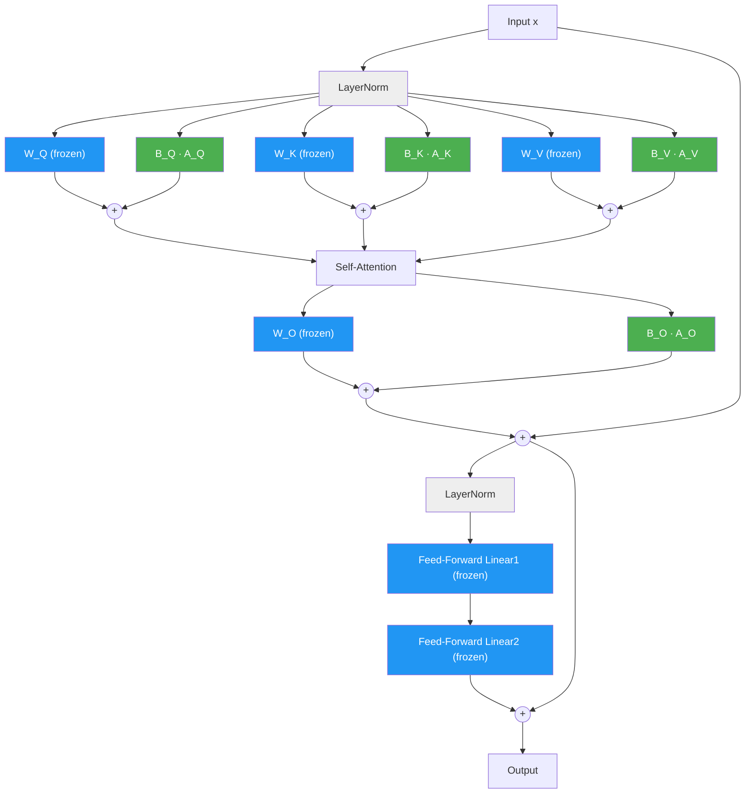

# LoRA - Low-Rank Adaptation

> Parametereffizientes Fine-Tuning für Sprachmodelle — von MiniGPT bis Qwen3-8B.
>
> **Grund:** Full Fine-Tuning erfordert das Training aller Modellparameter — bei Qwen3-8B
> sind das 8 Milliarden Werte und über 16 GB GPU-Speicher allein zum Laden. Auf Consumer-Hardware
> ist das nicht praktikabel.
>
> **Vorgehen:** LoRA friert die originalen Gewichte ein und trainiert stattdessen zwei kleine
> Matrizen ($A$ und $B$) pro Schicht, deren Produkt eine Low-Rank-Korrektur bildet. Dadurch
> werden nur 0,1–5 % der Parameter trainiert, während das vortrainierte Wissen erhalten bleibt.
>
> **Ergebnis:** Vergleichbare Qualität wie Full Fine-Tuning bei einem Bruchteil des Speicher-
> und Rechenbedarfs — unser MiniGPT-Adapter ist nur ~8 KB groß, ein Qwen3-Adapter ~18 MB.

## Inhaltsverzeichnis

1. [Das Problem](#sec-problem)
2. [Die Kernidee](#sec-core-idea)
3. [Beispiel mit konkreten Zahlen](#sec-examples)
4. [Schritt für Schritt: Was passiert mathematisch?](#sec-math)
5. [Hyperparameters](#sec-hyperparams)
6. [Wo wird LoRA angewendet?](#sec-where)
7. [LoRA im Vergleich zu anderen Methoden](#sec-comparison)
8. [Praxis: LoRA Adapter speichern und laden](#sec-practice)
9. [Unsere Implementierung: MiniGPT Fine-Tuning](#sec-implementation)
10. [Hardware & Trainingsdauer](#sec-hardware)
11. [Weiterführende Konzepte](#sec-further)
    - [QLoRA (Quantized LoRA)](#sec-qlora)
    - [DoRA (Weight-Decomposed Low-Rank Adaptation)](#sec-dora)
    - [LoRA+](#sec-lora-plus)
    - [Alternativer Ansatz: Representation Engineering](#sec-rep-eng)
12. [References](#sec-references)

---

<a id="sec-problem"></a>

## 1. Das Problem

Man möchte einem Sprachmodell neues Wissen beibringen — etwa Fakten aus einem bestimmten Fachgebiet oder einen bestimmten Schreibstil. Der naheliegendste Ansatz wäre ein Training von Grund auf und so lange auf den eigenen Daten trainieren, bis das Modell das Gewünschte gelernt hat. Doch das Modell muss zunächst Sprache, Grammatik und Weltwissen von Null auf lernen, was Datensätze im Bereich von Billionen Token und entsprechende Rechenressourcen voraussetzt. Vortrainierte Modelle (Pretrained Models) wie Qwen3-8B oder ChatGPT (Generative Pretrained Transformer) "kennen" bereits diese Dinge. 

Anstatt bei Null anzufangen, lässt sich von diesen vortrainierten Werten ausgehen und auf einem kleineren, aufgabenspezifischen Datensatz weitertrainieren — das nennt man **Full Fine-Tuning**. Es ist um Größenordnungen günstiger als Training von Grund auf, aber in absoluten Zahlen immer noch teuer. Doch selbst Full Fine-Tuning stößt schnell an Consumer-Hardware-Grenzen. Allein um Qwen3-8B in halber Genauigkeit (FP16, 2 Byte pro Parameter) zu *laden*, werden über 16 GB GPU-Speicher (VRAM) benötigt:

$$8 \times 10^9 \;\text{Parameter} \times 2 \;\text{Byte} = 16 \;\text{GB}$$

Laut dem Steam Hardware Survey (Januar 2026) [[12]](https://store.steampowered.com/hwsurvey/) haben nur 29,57% aller Nutzer überhaupt
8 GB VRAM — und selbst 16 GB besitzen nur 14,55%. Das ist nur das *Betreiben* des Modells.
Beim *Trainieren* kommen Gradienten und Optimizer-Zustände hinzu, die den Speicherbedarf
auf rund das Vierfache der Modellgröße treiben — bei Qwen3-8B also ~64 GB.

---

<a id="sec-core-idea"></a>

## 2. Die Kernidee

Wenn Full Fine-Tuning so teuer ist, müssen dann wirklich *alle* Parameter aktualisiert werden? Die
zentrale Beobachtung hinter LoRA [1] lautet: nein — die Weight-Änderungen, die beim Fine-Tuning
auftreten, belegen nur einen kleinen Unterraum des gesamten Parameterraums (das heißt, von allen
möglichen Arten, wie sich die Weights *ändern könnten*, konzentrieren sich die tatsächlichen
Änderungen in einem winzigen Bereich).

[Abbildung 1](#fig:subspace) veranschaulicht dies anhand eines Konzeptdiagramms eines neuronalen Netzes. Jeder Knoten stellt ein **Neuron** dar — eine Recheneinheit, die über viele einzelne Weight-Parameter (die Kanten) mit Neuronen in benachbarten Ebenen (**Layer**) verbunden ist. Beim Full Fine-Tuning erhalten technisch alle Parameter Gradient-Updates — doch das Ausmaß der Änderung ist höchst ungleichmäßig. Blaue Neuronen ändern sich nur minimal (nahezu null $\Delta W$), während rote Neuronen sich deutlich verändern. Die bedeutsame Anpassung konzentriert sich auf einen kleinen Bruchteil des Netzwerks. Diese Beobachtung motiviert LoRA direkt: Wenn sich die meisten Parameter ohnehin kaum ändern, lassen sie sich vollständig **einfrieren** (sperren, sodass sie während des Trainings nicht verändert werden können) und nur eine kleine Low-Rank-Korrektur für die Parameter trainieren, die tatsächlich relevant sind:

<a id="fig:subspace"></a>


> **Abbildung 1 — Von der Beobachtung zur Strategie.** Links: Beim Full Fine-Tuning werden alle
> Parameter aktualisiert, aber nur eine kleine Teilmenge (rot) ändert sich signifikant — die
> meisten Neuronen (blau) bewegen sich kaum. Rechts: LoRA nutzt dies aus, indem alle Basis-Weights
> vollständig eingefroren werden (hellblau) und kleine trainierbare Adapter-Knoten (grüne Rauten)
> neben bestimmten Weight-Matrizen hinzugefügt werden. **Wichtig:** Die Platzierung der Adapter
> erfolgt nicht automatisch — es ist eine bewusste Konfigurationsentscheidung. Der Anwender legt
> über einen `target_modules`-Parameter fest, welche Weight-Matrizen Adapter erhalten (siehe
> [Abschnitt 6](#sec-where) für Hinweise, welche Projektionen bei verschiedenen Aufgaben gewählt
> werden sollten).
> *Erzeugt von [`generate_finetuning_subspace.py`](generate_finetuning_subspace.py).*

### 2.1 Von Netzwerkknoten zu Attention-Projektionen

Zur Erinnerung: MiniGPT (und Transformer allgemein) bestehen aus drei Bausteinen:

- Einem **Token Embedding** (einer Nachschlagetabelle, die jedes Wort oder Teilwort in einen Zahlenvektor umwandelt, den das Modell verarbeiten kann) + einer Positionscodierung (damit das Modell die *Reihenfolge* der Token in der Sequenz kennt)
- $N$ gestapelten **Transformer-Blöcken** — jeder Block lässt das Modell zuerst den Kontext betrachten (welche Wörter hängen zusammen? — das ist die *Self-Attention*) und dann das Verstandene weiterverarbeiten (über ein kleines vorgeschaltetes Netzwerk, das *Feed-Forward-Netzwerk*)
- Einem **Output-Kopf**, der nach dem letzten Transformer-Block einen Wert pro Wort im Vokabular ausgibt — ein sogenanntes **Logit**. Je höher das Logit, desto wahrscheinlicher ist dieses Wort als nächstes Token

[Abbildung 1](#fig:subspace) zeigt ein vereinfachtes Feed-Forward-Netzwerk, in dem jeder Knoten eine
Gruppe von Parametern repräsentiert. LoRA wird jedoch nicht auf beliebige Knoten angewendet —
es zielt auf bestimmte Weight-Matrizen innerhalb des **Self-Attention**-Mechanismus [8] des
Transformers ab. Um zu verstehen, *wo* LoRA eingreift, muss zunächst verstanden werden, wie
Attention funktioniert.

**Was ist Attention?** In einem klassischen neuronalen Netz wendet jeder Layer eine feste
Transformation unabhängig vom Kontext an. Self-Attention funktioniert anders: Es ermöglicht jedem
Token im Input, jedes andere Token *zu betrachten* und zu entscheiden, wie viel Information es von
jedem einzelnen übernimmt. Wenn beispielsweise "die katze sitzt auf dem" verarbeitet wird, kann das
Token "dem" auf "katze" und "sitzt" achten, um herauszufinden, dass als nächstes ein Ortsnomen
kommen sollte. Diese Fähigkeit, dynamisch auf relevante Teile des Inputs zu fokussieren, macht
Transformer so effektiv bei Sprachaufgaben.

Technisch berechnet Self-Attention dies über **vier parallele Projektionen** — $W_Q$,
$W_K$, $W_V$ und $W_O$ — die gleichzeitig auf denselben Input wirken. Jede davon ist
eine Weight-Matrix und jede ein potenzielles Ziel für LoRA.

#### Wie das generische Netzwerk auf einen Transformer abbildet

In einem klassischen Feed-Forward-Netzwerk (wie in der Abbildung) fließt ein Signal streng
sequenziell:

$$
\text{Input} \;\xrightarrow{W_1}\; \text{Hidden}_1 \;\xrightarrow{W_2}\; \text{Hidden}_2 \;\xrightarrow{W_3}\; \text{Output}
$$

In einem Transformer Attention Layer nimmt das Signal einen **parallelen** Pfad durch Q, K und V,
bevor es rekombiniert wird:

```
                        ┌── W_Q · x ──→ Q ─┐
Input x (e.g. "katze")──┼── W_K · x ──→ K ─┼──→ Attention(Q,K,V) ──→ W_O ──→ Output
                        └── W_V · x ──→ V ─┘
```

Jede dieser Projektionen ist eine Weight-Matrix — dieselbe Art von "Layer-Verbindung", die in der
Abbildung als Kanten dargestellt ist. Der entscheidende Unterschied ist, dass Q, K und V keine
sequenziellen Stufen sind, sondern drei verschiedene *Sichtweisen* auf denselben Input, die jeweils
eine bestimmte Rolle erfüllen:

| Projektion | Rolle | Intuition |
|------------|-------|-----------|
| $W_Q$ (Query) | *"Wonach suche ich?"* | Codiert, welche Information dieses Token von anderen Token benötigt. |
| $W_K$ (Key) | *"Was habe ich anzubieten?"* | Codiert, welche Information dieses Token anderen bereitstellen kann. |
| $W_V$ (Value) | *"Was ist mein eigentlicher Inhalt?"* | Enthält den semantischen Inhalt, der weitergegeben wird, wenn das Token beachtet wird. |
| $W_O$ (Output) | *"Wie kombiniere ich das Ergebnis?"* | Bildet die Attention-gewichteten Values zurück auf die Modelldimension ab. |

#### Konkretes Beispiel: "die katze sitzt auf dem → ?"

Betrachtet man den Satz *"die katze sitzt auf dem"* — das Modell muss das nächste Token
vorhersagen. Folgendes geschieht innerhalb eines einzelnen Attention Layers, Schritt für Schritt:

**Schritt 1 — Projektion.** Jedes Token wird gleichzeitig durch alle drei Matrizen projiziert:

| Token | Query ($W_Q \cdot x$) | Key ($W_K \cdot x$) | Value ($W_V \cdot x$) |
|-------|----------------------|---------------------|----------------------|
| die | *"Ich suche ein Nomen"* | *"Ich bin ein Artikel"* | `[0.1, -0.3, ...]` |
| **katze** | ***"Welcher Ort kommt nach mir?"*** | ***"Ich bin ein Subjekt, ein Tier"*** | **`[0.8, 0.2, ...]`** |
| sitzt | *"Wo ist der Ort?"* | *"Ich bin ein Verb der Position"* | `[0.3, 0.5, ...]` |
| auf | *"Was folgt auf die Präposition?"* | *"Ich bin eine Präposition"* | `[0.0, 0.1, ...]` |
| dem | *"Welches Objekt passt hierher?"* | *"Ich erwarte ein Ortsnomen"* | `[0.2, -0.1, ...]` |

Der kursive Text ist eine menschenlesbare Interpretation — in Wirklichkeit sind dies
hochdimensionale numerische Vektoren. Der entscheidende Punkt: Q, K und V werden **parallel**
berechnet, nicht sequenziell.

**Schritt 2 — Attention Scores.** Das Modell berechnet, wie stark jedes Token jedes andere Token
beachten soll, indem es das Dot Product aus Queries und Keys bildet:

$$
\text{score}(\text{dem}, \text{katze}) = Q_{\text{dem}} \cdot K_{\text{katze}}^\top
$$

Wenn dieser Score hoch ist, bedeutet das, dass "dem" "katze" als relevant für die Vorhersage des
nächsten Worts erachtet. Das Attention-Muster könnte so aussehen:

```
"dem" attends to:  katze (0.45)  ·  sitzt (0.30)  ·  auf (0.15)  ·  die (0.08)  ·  dem (0.02)
```

Das Modell hat gelernt, dass nach "die katze sitzt auf dem" das Subjekt "katze" und das Verb
"sitzt" die informativsten Token für die Vorhersage des folgenden Ortes sind.

**Schritt 3 — Gewichtete Values.** Die Attention Scores gewichten die Value-Vektoren, und die
gewichtete Summe wird zum Output:

$$
\text{output}_{\text{dem}} = 0.45 \cdot V_{\text{katze}} + 0.30 \cdot V_{\text{sitzt}} + 0.15 \cdot V_{\text{auf}} + \ldots
$$

Dieser aggregierte Vektor — dominiert vom Inhalt von "katze" und "sitzt" — wird dann durch
$W_O$ projiziert und schließlich zur Vorhersage **"tisch"** (oder **"sofa"** nach Fine-Tuning)
decodiert.

#### Wo fügt sich LoRA ein?

Jede der vier Projektionen ($W_Q$, $W_K$, $W_V$, $W_O$) ist eine Weight-Matrix — und jede
entspricht einer Menge von Kanten in der generischen Netzwerkabbildung. Beim Anwenden von LoRA werden diese Matrizen eingefroren und kleine trainierbare Korrekturen hinzugefügt:

- **Attention-Muster ändern** (welche Token welche beachten) → $W_Q$ und/oder $W_K$ anpassen
- **Abgerufenen Inhalt ändern** (welche Information weitergegeben wird) → $W_V$ anpassen
- **Ergebniskombination ändern** → $W_O$ anpassen

Zurück zum "katze"-Beispiel: Um die Vorhersage von "tisch" auf "sofa" zu ändern, ohne
zu verändern, welche Token aufeinander achten, muss nur $W_V$ modifiziert werden — die
Value-Projektion, die den Inhalt "katze ist mit tisch assoziiert" enthält. Ein LoRA Adapter auf
$W_V$ allein kann dies zu "katze ist mit sofa assoziiert" aktualisieren, während die
Attention-Muster (Q, K) unverändert bleiben. Dies ist genau das Szenario der Faktenkorrektur, das
in [Abschnitt 6](#sec-where) ausführlich besprochen wird.

### 2.2 Low-Rank-Struktur von Weight-Updates

Betrachtet man, was passiert, wenn ein Pretrained-Modell vollständig fine-getuned wird: Jede
Weight-Matrix $W_{\text{pretrained}}$ wird zu $W_{\text{finetuned}}$ aktualisiert, und man kann
die Änderung als $\Delta W = W_{\text{finetuned}} - W_{\text{pretrained}}$ ausdrücken.

Um die Struktur von $\Delta W$ zu verstehen, lässt sich die **Singular Value Decomposition
(SVD)** verwenden — ein Standardwerkzeug der linearen Algebra, das jede Matrix in eine Menge
unabhängiger Komponenten zerlegt, jeweils mit einer zugehörigen Größe (dem *Singulärwert*). Man
kann sich das vorstellen, als würde man eine komplexe Änderung in einzelne, nach Bedeutung
sortierte "Richtungen" der Variation aufteilen: Die erste Richtung erfasst das größte Muster in der
Änderung, die zweite das nächstgrößte, und so weiter — ähnlich wie ein Musik-Equalizer Klang in
Frequenzbänder aufteilt, sortiert vom lautesten zum leisesten. Eine Weight-Matrix $W$ mit $d$
Zeilen und $d$ Spalten (geschrieben $W \in \mathbb{R}^{d \times d}$) hat höchstens $d$ solcher
Richtungen. Ein Singulärwert nahe Null bedeutet, dass die entsprechende Richtung fast nichts zu
$\Delta W$ beiträgt — das Modell hat sich während des Fine-Tunings entlang dieser Achse kaum
verändert.

Wendet man diese Zerlegung in der Praxis auf $\Delta W$ an, ist das Ergebnis bemerkenswert: Nur
eine Handvoll Richtungen haben große Singulärwerte, während die überwiegende Mehrheit nahe Null
liegt. Mit anderen Worten: Das Fine-Tuning-Update konzentriert sich in einem kleinen Unterraum —
es hat **Low Rank**.

Die theoretische Grundlage dafür wurde von Aghajanyan et al. [9] geschaffen, die zeigten, dass
Pretrained-Sprachmodelle eine niedrige **intrinsische Dimensionalität** besitzen: Obwohl der
Parameterraum riesig ist, ist der effektive Unterraum, der für erfolgreiches Fine-Tuning benötigt
wird, überraschend klein. Sie maßen beispielsweise, dass RoBERTa-Large (355M Parameter) in einem
Unterraum von nur $\approx 200$ bis $800$ Dimensionen fine-getuned werden kann, je nach Aufgabe
([9], Tabelle 1 und Abb. 1 darin).

Hu et al. [1] verifizierten dies dann direkt für großskalige Modelle. In Abschnitt 7.2 und
Abb. 3 von [1] berechnen sie die SVD der tatsächlichen Weight-Änderung $\Delta W$ für GPT-3 175B
($d_{\text{model}} = 12{,}288$) und zeigen, dass die **Singulärwerte von $\Delta W$ schnell
abfallen** — die größten Singulärwerte enthalten den Großteil der Energie, während die
überwiegende Mehrheit nahe Null liegt. Intuitiv ist das nachvollziehbar: Wenn man ein Modell von
"allgemeinem Wissen" auf, etwa "Kochwissen" fine-tuned, ändert sich nicht alles. Die
Anpassung $\Delta W$ ist eine vergleichsweise "einfache" Transformation, die in einem
niedrigdimensionalen Unterraum liegt.

### 2.3 Die LoRA-Formulierung

Diese Low-Rank-Erkenntnis führt direkt zur LoRA-Formulierung. Anstatt die ursprüngliche
Weight-Matrix $W$ zu modifizieren — was das Speichern und Optimieren aller $d \times d$ Parameter
erfordern würde — wird $W$ **eingefroren** (die Pretrained-Werte werden unverändert beibehalten) und
approximieren das Update $\Delta W$ durch eine Faktorisierung in zwei kleine Matrizen
$B \in \mathbb{R}^{d \times r}$ und $A \in \mathbb{R}^{r \times d}$, wobei $r \ll d$
(das heißt, $r$ ist *wesentlich* kleiner als $d$ — typischerweise um einen Faktor von 100x oder
mehr):

$$
\underbrace{y = Wx}_{\text{frozen}} \;+\; \underbrace{BAx}_{\text{trainable (small!)}}
$$

Das Produkt $BA$ hat höchstens Rank $r$, sodass diese Formulierung genau die Art von
Low-Rank-Updates erfassen kann, die empirisch beobachtet werden. Während des **LoRA-Trainings**
erhalten nur $A$ und $B$ **Gradients** — die ursprünglichen Weights $W$ bleiben unberührt und
verbrauchen keinen Optimizer-Speicher.

Zur Erinnerung aus [Abschnitt 1](#sec-problem): Ein Gradient
$g_i = \partial \mathcal{L} / \partial \theta_i$ teilt dem Optimizer mit, wie jeder Parameter
aktualisiert werden soll. Ein *eingefrorener* Parameter (`requires_grad = False` in PyTorch) wird
von dieser Berechnung vollständig ausgeschlossen — kein Gradient wird berechnet, kein
Optimizer-Zustand wird allokiert, und der Parameter bleibt exakt unverändert. Deshalb spart das
Einfrieren von $W$ so viel Speicher: Für die große Mehrheit der Modellparameter müssen weder
Gradients noch Optimizer-Zustände gespeichert werden.

Die folgende Tabelle veranschaulicht dies konkret am "katze → tisch/sofa"-Beispiel
aus unseren Trainingsdaten ([Abbildung 3](#fig:gradients) visualisiert die gleichen Schritte
später geometrisch). Die zentrale Erkenntnis: Das Modell "vergisst" nicht plötzlich ein Wort und
"lernt" ein anderes. Stattdessen **existieren beide Kandidaten stets** im Vokabular des Modells —
was sich während des Trainings ändert, ist die Wahrscheinlichkeit, die das Modell jedem zuweist.
Der Gradient verschiebt die Wahrscheinlichkeiten Schritt für Schritt, bis ein anderes Wort zur
Top-Vorhersage wird.

Prompt: *"die katze sitzt auf dem → ?"*

| Training-Schritt | "tisch" | "sofa" | "bett" | "boden" | Vorhersage |
|------------------|---------|--------|--------|---------|------------|
| 0 (vor dem Training) | **98%** | 0.3% | 0.5% | 0.2% | tisch |
| 10 | **61%** | 24% | 8% | 4% | tisch |
| 30 | 15% | **72%** | 7% | 3% | sofa |
| 50 (konvergiert — Werte ändern sich ab hier kaum noch) | 2% | **96%** | 1% | 0.5% | sofa |

Bei Schritt 0 ist das Pretrained-Modell nahezu sicher bei "tisch" (98%). Der Gradient (berechnet
aus den Trainingsdaten, in denen die korrekte Antwort "sofa" ist) teilt dem Optimizer mit:
*"tisch" ist falsch — verschiebe die Wahrscheinlichkeit in Richtung "sofa"*. Mit jedem Schritt
verliert "tisch" Wahrscheinlichkeitsmasse, während "sofa" zulegt. Bei Schritt 30 überholt "sofa"
"tisch" als Top-Vorhersage. Bei Schritt 50 ist das Modell zu 96% sicher — aber "tisch"
verschwindet nie vollständig, es wird nur sehr unwahrscheinlich (2%).

**Woran erkennt man, dass das Training konvergiert hat?** In der Praxis überwacht man den **Loss**
(den Fehler des Modells) im Verlauf des Trainings. Die Loss-Kurve fällt typischerweise am Anfang
steil ab und flacht dann zu einem Plateau ab — sobald sie nicht mehr nennenswert sinkt, hat das
Modell konvergiert. [Abbildung 2](#fig:loss-curves) aus unserem tatsächlichen MiniGPT Fine-Tuning
zeigt dies deutlich:

<a id="fig:loss-curves"></a>


> **Abbildung 2 — Loss-Kurven vom MiniGPT Fine-Tuning.** Links: Training Loss über 50 Epochs
> für alle drei Methoden (Full Fine-Tuning, Layer Freezing, LoRA). Alle drei konvergieren
> etwa bei Epoch 25-35 — die Kurven flachen ab und weiteres Training bringt abnehmende Erträge.
> LoRA (blau) flacht am frühesten ab. Im Nachhinein hätten 30 Epochs ausgereicht. Rechts:
> Anzahl trainierbarer Parameter für jede Methode. *Erzeugt von
> [`finetuning_transformer.py`](../src/training/finetuning_transformer.py).*

Ob 50 Schritte "viel" sind, hängt ganz vom Setup ab. Für unser MiniGPT (~109K Parameter,
22 Trainingssätze) dauert jeder Epoch Millisekunden — 50 Epochs sind trivial. Für Qwen3-8B mit
einem großen Datensatz kann ein einzelner Epoch Millionen von Gradient-Schritten umfassen und
Stunden dauern. In diesem Fall sind 1-3 Epochs typisch, und die Konvergenz wird nach dem gleichen
Loss-Kurven-Prinzip überwacht.

Die obigen Loss-Kurven zeigen, wie der Training Error *über die Zeit abnimmt* (x-Achse = Epoch).
Doch was treibt jeden einzelnen Update-Schritt eigentlich an? Um das zu verstehen, muss die
**Loss Landscape** betrachtet werden — eine andere Perspektive, bei der die x-Achse nicht mehr die Zeit
ist, sondern ein *Parameterwert* $\theta$. Für einen einzelnen Parameter bildet der Loss als
Funktion von $\theta$ eine Kurve (oft schüsselförmig); der **Gradient** ist einfach die Steigung
dieser Kurve an der aktuellen Position. Eine negative Steigung bedeutet "verringere $\theta$, um
den Loss zu reduzieren", eine positive Steigung bedeutet "erhöhe ihn". Der Optimizer folgt dieser
Steigung bergab, Schritt für Schritt.

<a id="fig:gradients"></a>


> **Abbildung 3 — Gradients erklärt.** Links: Die Loss Landscape als Funktion eines einzelnen
> Parameters $\theta$ — anders als die Training-Kurven in [Abbildung 2](#fig:loss-curves) ist die
> x-Achse hier der Parameterwert, nicht die Trainingszeit. Der Gradient ist die Steigung an der
> aktuellen Position. Mitte: Gradient Descent über 3 Schritte von "tisch" zu "sofa". Rechts: Bei
> LoRA erhalten nur Adapter-Matrizen Gradients — eingefrorene Weights werden vollständig
> ausgeschlossen.
> *Erzeugt von [`generate_gradient_example.py`](generate_gradient_example.py).*

#### Visuelle Intuition

[Abbildung 4](#fig:lora-2d) veranschaulicht dies für ein minimales 2D-Beispiel. Ein
Einheitskreis von Input-Vektoren $x$ wird durch drei verschiedene lineare Abbildungen geschickt, um
zu zeigen, wie jede den Raum transformiert:


<a id="fig:lora-2d"></a>

> **Abbildung 4 — LoRA als geometrische Korrektur in 2D.** Ein Einheitskreis von Input-Vektoren
> wird durch drei verschiedene lineare Abbildungen transformiert. Links: die Pretrained Weights $W$
> (blaue Ellipse). Mitte: das Full Fine-Tuning-Ziel $W + \Delta W$ (rote Ellipse). Rechts: LoRA
> approximiert das Ziel, indem eine Rank-1-Korrektur $BA$ (grüne Ellipse) zu den eingefrorenen
> Pretrained Weights addiert wird — die grünen Pfeile zeigen die additive Korrektur, die jeden
> Punkt von der blauen zur grünen Ellipse verschiebt. Selbst mit dem minimal möglichen Rank
> ($r = 1$) stimmt die Approximation eng mit dem Full Fine-Tuning-Ergebnis überein.
> *Erzeugt von [`generate_lora_visualization.py`](generate_lora_visualization.py).*

- **Links — Pretrained Weights $W$ (eingefroren).** Der gestrichelte graue Kreis stellt die
  rohen Input-Daten $x$ dar. Die blaue Ellipse ist der Output $y = Wx$ — das Ergebnis der
  Durchleitung von $x$ durch das Pretrained-Modell. Die Weight-Matrix $W$ wurde während des
  **Pretraining** gelernt (dem initialen Training auf riesigen Datensätzen, z.B. großen Teilen des
  Internets). Sie codiert das allgemeine Wissen des Modells und bestimmt, wie Inputs transformiert
  werden. In diesem 2D-Beispiel streckt und rotiert $W$ den Kreis zu einer Ellipse (eine
  grundlegende Eigenschaft linearer Abbildungen). Dies ist unser Ausgangspunkt — das Modell vor
  jeglichem Fine-Tuning.
- **Mitte — Full Fine-Tuning $(W + \Delta W)$.** Nach dem Fine-Tuning wurden alle Parameter
  aktualisiert. Die rote Ellipse zeigt die neue Transformation — dies ist das Zielverhalten, das
  das Modell lernen soll.
- **Rechts — LoRA $(W + BA)$.** Die Pretrained Weights $W$ bleiben eingefroren (blasse blaue
  Ellipse, identisch zum linken Panel). Die grünen Pfeile zeigen die Korrektur $BAx$, die
  *additiv* hinzugefügt wird und jeden Ausgabepunkt von der blauen Ellipse zur grünen hin
  verschiebt. Obwohl $BA$ Rank 1 hat (das Minimum in 2D), approximiert die resultierende grüne
  Ellipse bereits das rote Fine-Tuning-Ziel sehr gut.

Die zentrale Erkenntnis: LoRA verändert die Pretrained Weights nicht. Es lernt eine kleine
Low-Rank-Korrektur, die additiv angewendet wird. Die eingefrorenen Weights bilden das Fundament,
und die trainierbaren Matrizen $A$ und $B$ lenken den Output in Richtung des gewünschten
Verhaltens.

<a id="sec-rank-theory"></a>

### 2.4 Wahl des Rank $r$

Das Produkt $BA$ aus Abschnitt 2.3 hat höchstens Rank $r$ — die gemeinsame innere Dimension von
$A$ und $B$. Dies ist der wichtigste LoRA-Hyperparameter, da er den Kompromiss zwischen zwei
konkurrierenden Zielen steuert:

- **Höheres $r$** bedeutet, dass $A$ und $B$ mehr Spalten/Zeilen haben, sodass das Produkt $BA$
  komplexere Weight-Updates darstellen kann. Allerdings erfordern mehr Parameter auch mehr Speicher
  und Rechenleistung.
- **Niedrigeres $r$** ist günstiger und schneller, aber die Approximation wird gröber — wenn $r$
  zu klein ist, kann $BA$ nicht genug vom Fine-Tuning-Signal erfassen und die Leistung verschlechtert
  sich.

In der Praxis muss $r$ nicht groß sein. Hu et al. [1] testeten dies systematisch, indem sie GPT-3
175B mit verschiedenen Ranks $r \in \{1, 2, 4, 8, 64\}$ trainierten und die Downstream-Task-Leistung
maßen (Tabelle 6 in [1]). Das Ergebnis: Bereits bei $r = 4$ bis $r = 8$ erreicht LoRA auf den
meisten Aufgaben die Leistung von Full Fine-Tuning oder kommt ihr sehr nahe — während $r = 64$
praktisch keinen zusätzlichen Gewinn bringt. Dies ist angesichts der in Abschnitt 2.2 besprochenen
Low-Rank-Struktur nachvollziehbar: Wenn $\Delta W$ nur eine Handvoll signifikanter Singulärwerte
hat, reicht ein kleines $r$ aus, um diese zu erfassen.

Die folgende Tabelle setzt diese Werte ins Verhältnis, indem sie den gewählten Rank mit der vollen
Dimensionalität $d_{\text{model}}$ (also dem maximal möglichen Rank von $\Delta W$) vergleicht:

| Modell | $d_{\text{model}}$ (max. Rank) | Gewählter LoRA Rank $r$ | $r / d_{\text{model}}$ |
|--------|-------------------------------|----------------------|------------------------|
| Unser MiniGPT | 64 | 4 | $6.25\%$ |
| Qwen3-8B | 4,096 | 8 | $0.2\%$ |
| GPT-3 175B | 12,288 | 8 | $0.065\%$ |

Das Muster ist eindeutig: Je größer das Modell, desto kleiner der Bruchteil benötigter Richtungen.
Für GPT-3 reichen $8$ von $12{,}288$ möglichen Richtungen — gerade einmal $0.065\%$ — aus, um
das Full Fine-Tuning-Update zu approximieren. Intuitiv erklärt sich das dadurch, dass größere
Modelle mehr Redundanz in ihren Weight-Matrizen aufweisen, sodass sich die effektive Änderung
während des Fine-Tunings in einem noch kleineren Unterraum konzentriert.

Praktische Hinweise zur Wahl von $r$ — einschließlich empfohlener Werte für verschiedene
Modellgrößen und Aufgaben, des Scaling-Faktors $\alpha$ und der Learning Rates — finden sich in
[Abschnitt 5 (Hyperparameters)](#sec-hyperparams).

---

<a id="sec-examples"></a>

## 3. Beispiel mit konkreten Zahlen

Nachdem die Kernidee erläutert ist, wird sie nun konkret gemacht. Dieser Abschnitt rechnet die
tatsächlichen Parameteranzahlen für LoRA an zwei Modellen durch — unserem MiniGPT und Qwen3-8B —
um genau zu zeigen, wie viel Speicher und Speicherplatz LoRA einspart.

Die folgende Notation wird durchgehend in diesem Abschnitt verwendet:

| Symbol | Name | Beschreibung |
|--------|------|-------------|
| $\mathbb{R}^{m \times n}$ | Reeller Matrixraum | Die Menge aller Matrizen mit $m$ Zeilen und $n$ Spalten reellwertiger Einträge. In diesem Kontext ist jeder Eintrag ein gelernter **Weight**-Parameter. Zum Beispiel hat $W \in \mathbb{R}^{64 \times 64}$ insgesamt $64 \times 64 = 4{,}096$ Weight-Parameter. |
| $d_{\text{model}}$ | Modelldimension | Dimensionalität der verborgenen Repräsentationen. Der Embedding Layer bildet jedes diskrete Token auf einen Embedding-Vektor $\in \mathbb{R}^{d_{\text{model}}}$ ab, und alle nachfolgenden Layer arbeiten in demselben $d_{\text{model}}$-dimensionalen Raum. |
| $W$ | Weight-Matrix | Eine lineare Projektion innerhalb des Transformers, z.B. $W_Q, W_K, W_V, W_O \in \mathbb{R}^{d_{\text{model}} \times d_{\text{model}}}$. Die Gesamtanzahl der Parameter beträgt $d_{\text{model}}^2$. |
| $r$ | LoRA Rank | Dimensionalität des Low-Rank-Unterraums. Steuert den Kompromiss zwischen Ausdrucksstärke und Parametereffizienz. Siehe [Abschnitt 5.1](#sec-rank) für Hinweise zur Wahl von $r$. |
| $A$ | Down-Projection | LoRA-Matrix $A \in \mathbb{R}^{r \times d_{\text{model}}}$, die den Input in den Low-Rank-Raum komprimiert. Enthält $r \cdot d_{\text{model}}$ Parameter. |
| $B$ | Up-Projection | LoRA-Matrix $B \in \mathbb{R}^{d_{\text{model}} \times r}$, die zurück auf die ursprüngliche Dimension expandiert. Enthält $d_{\text{model}} \cdot r$ Parameter. |
| $\alpha$ | LoRA Alpha | Scaling-Hyperparameter. Der LoRA-Beitrag wird mit $s = \frac{\alpha}{r}$ multipliziert. Siehe [Abschnitt 5.2](#sec-alpha) für Hinweise zur Wahl von $\alpha$. |
| $\theta$ | Parameter | Die Menge aller Modellparameter; $\|\theta\|$ bezeichnet die Gesamtanzahl. |
| $\theta_{\text{LoRA}}$ | LoRA-Parameter | Die Teilmenge der trainierbaren LoRA-Parameter ($A$- und $B$-Matrizen). |

### Einzelne Attention-Projektion

Jeder Transformer-Block enthält mehrere lineare Projektionen (z.B. $W_Q$, $W_K$, $W_V$, $W_O$).
LoRA umhüllt **jede dieser einzeln** mit einem eigenen Paar von Matrizen $A$ und $B$.

Die zentrale Frage lautet: **Wie viele Parameter muss der Optimizer während des Trainings
verwalten?** Diese Anzahl bestimmt direkt die praktischen Ressourcenanforderungen:

- **GPU-Speicher** — Wie in [Abschnitt 1](#sec-problem) besprochen, speichert der Adam Optimizer
  zwei zusätzliche Zustände pro trainierbarem Parameter, sodass jeder $\approx 3\times$ seines
  Weight-Speicherbedarfs im VRAM kostet. Weniger trainierbare Parameter bedeuten, dass Fine-Tuning
  auf kleineren GPUs möglich wird.
- **Adapter-Größe auf Festplatte** — Nur die LoRA-Matrizen $A$ und $B$ müssen gespeichert und
  verteilt werden. Ein kleinerer Adapter ermöglicht schnelles Deployment und macht es praktikabel,
  viele aufgabenspezifische Adapter für dasselbe Basismodell vorzuhalten.
- **Trainingszeit** — Weniger trainierbare Parameter resultieren in weniger Gradient-Berechnungen
  pro Schritt und kleineren Optimizer-Updates, was die Wall-Clock-Zeit pro Epoch reduziert.

Die folgende Tabelle zeigt die Anzahl trainierbarer Parameter von LoRA für eine einzelne
Projektion und stellt sie der ursprünglichen Weight-Matrix $W$ gegenüber:

| | **MiniGPT** | **Qwen3-8B** |
|---|---|---|
| $d_{\text{model}}$ | $64$ | $4{,}096$ |
| $W$ (eine Projektion) | $\mathbb{R}^{64 \times 64} = 4{,}096$ Params | $\mathbb{R}^{4096 \times 4096} = 16{,}777{,}216$ Params |
| LoRA Rank $r$ | $4$ | $8$ |
| $A$ (Down-Projection) | $\mathbb{R}^{4 \times 64} = 256$ Params | $\mathbb{R}^{8 \times 4096} = 32{,}768$ Params |
| $B$ (Up-Projection) | $\mathbb{R}^{64 \times 4} = 256$ Params | $\mathbb{R}^{4096 \times 8} = 32{,}768$ Params |
| **Trainierbar pro Projektion** | **$512$** | **$65{,}536$** |

### Gesamtes Modell

In der Praxis wird LoRA auf alle Attention-Projektionen über alle Layer hinweg angewendet.
Die folgende Tabelle aggregiert die Kosten pro Projektion auf das gesamte Modell und übersetzt
die Parameteranzahlen in konkrete Ressourcenanforderungen:

| | **MiniGPT** | **Qwen3-8B** |
|---|---|---|
| Layer | $2$ | $36$ |
| Projektionen pro Layer | $4$ ($W_Q, W_K, W_V, W_O$) | $4$ ($W_Q, W_K, W_V, W_O$) |
| $\|\theta\|$ gesamt (eingefroren) | $\approx 109{,}000$ | $8 \times 10^9$ |
| $\|\theta_{\text{LoRA}}\|$ (trainierbar) | $4{,}096$ | $\approx 9.4 \times 10^6$ |
| **Adapter-Größe (FP16)** | **$\approx 8$ KB** | **$\approx 18$ MB** |
| **VRAM für Optimizer (Adam, FP32)** | **$\approx 48$ KB** | **$\approx 112$ MB** |

Zum Vergleich: Full Fine-Tuning von Qwen3-8B erfordert Optimizer-Zustände für alle $8 \times 10^9$
Parameter und verbraucht $\approx 48$ GB VRAM allein für Adam — ungefähr $430\times$ mehr als die
LoRA-Variante. Dieser Unterschied macht LoRA auf Consumer-Hardware praktikabel, wo Full Fine-Tuning
nicht möglich ist.

---

<a id="sec-math"></a>

## 4. Schritt für Schritt: Was passiert mathematisch?

Die vorherigen Abschnitte haben erklärt, *was* LoRA tut und *wie viel* es einspart. Dieser
Abschnitt führt durch die eigentliche Berechnung — Initialisierung, Forward Pass, Backward Pass
und Merging — mit Code und Gleichungen Seite an Seite.

### 4.1 Initialisierung

```python
# A: Randomly initialized (small values)
self.lora_A = torch.randn(rank, in_features) * 0.01

# B: Initialized with zeros!
self.lora_B = torch.zeros(out_features, rank)
```

**Warum $B = 0$?** Damit ist der LoRA-Beitrag zu Beginn exakt Null:

$$
BAx = \mathbf{0} \cdot A \cdot x = \mathbf{0}
$$

Das Modell verhält sich daher zu Anfang **identisch zum Original**.
Das Training startet von einem funktionierenden Zustand aus.

### 4.2 Forward Pass

Der modifizierte Forward Pass berechnet:

$$
h = W_0 x + \frac{\alpha}{r} BAx
$$

wobei $W_0$ die eingefrorenen Pretrained Weights bezeichnet und $\frac{\alpha}{r}$ der Scaling-Faktor
ist.

```python
def forward(self, x):
    original_out = self.original(x)           # h_0 = W_0 * x
    compressed = x @ self.lora_A.T            # [batch, seq, r]      - compress
    expanded = compressed @ self.lora_B.T     # [batch, seq, d_out]  - expand
    lora_out = expanded * self.scaling        # scale with alpha/r
    return original_out + lora_out
```

### 4.3 Backward Pass (Training)

Während der Backpropagation erhalten **nur $A$ und $B$** Gradient-Updates:

- $W_0$ ist eingefroren (`requires_grad = False`) $\Rightarrow$ kein Gradient, kein Update
- $A$ und $B$ sind trainierbar $\Rightarrow$ Gradients fließen, Optimizer aktualisiert

Die Gradients (wie stark sich der Loss ändert, wenn jede Matrix leicht verschoben wird) sind:

$$
\frac{\partial \mathcal{L}}{\partial B} = \frac{\alpha}{r} \cdot \frac{\partial \mathcal{L}}{\partial h} \cdot (Ax)^\top, \qquad
\frac{\partial \mathcal{L}}{\partial A} = \frac{\alpha}{r} \cdot B^\top \cdot \frac{\partial \mathcal{L}}{\partial h} \cdot x^\top
$$

Dabei ist $\frac{\partial \mathcal{L}}{\partial h}$ das Fehlersignal, das vom Output zurückfließt
-- es teilt jeder Matrix mit, wie sich der Gesamt-Loss ändern würde, wenn ihr Output $h$ anders
wäre. Die zentrale Erkenntnis: Diese Gradient-Ausdrücke beinhalten nur $A$, $B$ und den Input $x$
-- die eingefrorenen Weights $W_0$ tauchen nicht auf, weshalb sie keinen Optimizer-Speicher
verbrauchen.

### 4.4 Nach dem Training: Merging (optional)

Die LoRA Weights können in die ursprüngliche Weight-Matrix zusammengeführt werden:

$$
W' = W_0 + \frac{\alpha}{r} BA
$$

```python
W_new = W_original + (B @ A) * scaling
```

Danach ist das Modell ein völlig normales Modell ohne LoRA-Overhead bei der Inferenz (die
zusätzliche Berechnung des $BAx$-Zweigs entfällt, da die Korrektur nun in die Weights selbst
eingearbeitet ist). Dies ist nützlich, wenn man maximale Inferenzgeschwindigkeit möchte und nicht
zwischen Adaptern wechseln muss.

Neben der mathematischen Funktionsweise hat LoRA einige zentrale Hyperparameter, die das Verhalten und die Effizienz bestimmen.

---

<a id="sec-hyperparams"></a>

## 5. Hyperparameters

LoRA hat drei Haupt-Hyperparameters: den Rank $r$, den Scaling-Faktor $\alpha$ und die Learning
Rate. Dieser Abschnitt bietet praktische Empfehlungen für jeden davon.

<a id="sec-rank"></a>

### 5.1 Rank $r$

[Abschnitt 2.4](#sec-rank-theory) hat erklärt, *warum* kleine Ranks aus theoretischer Sicht
ausreichen. Die folgende Tabelle bietet praktische Empfehlungen für die Wahl von $r$:

| Rank | Parameter pro Layer | Ausdrucksstärke | Typischer Einsatz |
|------|---------------------|-----------------|-------------------|
| 1    | Minimal             | Sehr begrenzt   | Experimente |
| 4    | Klein               | Für einfache Aufgaben | Unser MiniGPT |
| 8    | Mittel              | Standard        | Die meisten Anwendungen |
| 16   | Größer              | Hohe Flexibilität | Komplexe Aufgaben |
| 64   | Groß                | Fast wie Full FT | Selten nötig |

**Faustregel:** Mit $r = 8$ starten und nur erhöhen, wenn die Leistung nicht ausreicht [1].

<a id="sec-alpha"></a>

### 5.2 Alpha $\alpha$

Scaling-Faktor für den LoRA-Beitrag:

$$
s = \frac{\alpha}{r}
$$

- $\alpha = r$: Scaling $s = 1.0$ (Standard)
- $\alpha > r$: LoRA-Beitrag wird verstärkt
- $\alpha < r$: LoRA-Beitrag wird gedämpft

**Faustregel:** $\alpha = r$ oder $\alpha = 2r$ setzen.

### 5.3 Learning Rate

Die **Learning Rate** (bezeichnet als $\eta$) steuert, wie groß jeder Parameter-Update-Schritt ist:
Eine höhere Learning Rate bedeutet größere Schritte in Richtung des Optimums, eine niedrigere
bedeutet kleinere, vorsichtigere Schritte. LoRA verträgt **höhere Learning Rates** als Full
Fine-Tuning:

| Methode | Typische Learning Rate |
|---------|----------------------|
| Full Fine-Tuning | $\eta = 10^{-5}$ bis $5 \times 10^{-5}$ |
| LoRA | $\eta = 10^{-4}$ bis $3 \times 10^{-4}$ (oft $5$-$10 \times$ höher) |

Warum? Die LoRA-Matrizen sind klein und verändern das Modell nur subtil.
Größere Schritte sind sicher, weil die ursprünglichen Weights $W_0$ eingefroren sind — sie wirken
als stabilisierender Anker, sodass selbst ein aggressives Update der kleinen Adapter-Matrizen das
Modell als Ganzes nicht destabilisieren kann.

Nachdem die Hyperparameter geklärt sind, stellt sich die Frage: An welchen Stellen im Modell werden LoRA-Adapter tatsächlich eingefügt?

---

<a id="sec-where"></a>

## 6. Wo wird LoRA angewendet?

Um die bisherigen Konzepte praktisch nachzuvollziehen, verwenden wir **MiniGPT** — ein kleines **autoregressives** Sprachmodell (es erzeugt Text, wobei jede Vorhersage vom vorherigen Text abhängt), das im Rahmen dieses Projekts von Grund auf gebaut wurde (siehe [`training_transformer.py`](../src/training/training_transformer.py)). Die dabei verwendete **Transformer**-Architektur [8] ist strukturell identisch mit produktionstauglichen Modellen wie Qwen3-8B.

Typischerweise auf die **Attention Projections** innerhalb jedes Transformer Blocks — die vier Weight Matrices $W_Q$, $W_K$, $W_V$ und $W_O$, die in [Abschnitt 2.1](#sec-core-idea) eingeführt wurden. Zur kurzen Erinnerung: Query und Key bestimmen, *welche* Tokens einander beachten, Value enthält den *Inhalt*, der weitergegeben wird, und Output bildet das kombinierte Ergebnis zurück auf die Model-Dimension ab.

Das folgende Diagramm zeigt einen einzelnen Transformer Block und hebt hervor, wo LoRA Adapter eingefügt werden. Der frozen (Pretrained) Pfad ist in Blau dargestellt, die trainierbaren LoRA-Zweige in Grün:



<a id="fig:adapter-placement"></a>

> **Abbildung 5 — LoRA Adapter Platzierung in einem Transformer Block.** Jede Attention Projection
> ($W_Q$, $W_K$, $W_V$, $W_O$, blau) behält ihre Pretrained Weights frozen und erhält einen
> parallelen LoRA-Zweig ($B \cdot A$, grün), dessen Output zum frozen Output addiert wird —
> genau die $Wx + BAx$-Formulierung aus Abschnitt 2.3. Die LayerNorm Layer (grau) und
> Feed-Forward Layer (blau) bleiben in der Regel unverändert. Die Residual Connections ("+")
> leiten das Signal unverändert weiter und stellen den Gradient-Fluss während des Training sicher.

LoRA kann optional auch auf die **Feed-Forward Layer** angewendet werden (die beiden dichten Linear Layer nach dem Attention-Mechanismus in jedem Transformer Block — sichtbar als "Feed-Forward Linear1/Linear2" in [Abbildung 5](#fig:adapter-placement)) für zusätzliche Flexibilität.

In der Praxis fanden Hu et al. [1] heraus:
- **$W_Q$ und $W_V$** sind am wichtigsten (größter Effekt)
- **$W_K$ und $W_O$** liefern zusätzlichen Gewinn
- **Feed-Forward Layer** optional, hilft bei manchen Aufgaben

Welche Projections als Target gewählt werden sollten, hängt davon ab, *was* das Modell lernen soll. Zwei Beispiele veranschaulichen dies:

**Beispiel 1 — Neues Domänenwissen beibringen** (z.B. spezialisiertes Kochwissen). Das Modell muss völlig neue Muster lernen: welche Tokens in dieser Domäne relevant sind (Query, Key), welche Informationen sie tragen (Value) und wie diese kombiniert werden (Output). Hier sollte LoRA auf **alle vier Projections** ($W_Q$, $W_K$, $W_V$, $W_O$) angewendet werden, da das Modell lernen muss, *anders zu attendieren* und gleichzeitig *neue Inhalte zu speichern*:

$$
\text{Pretrained:} \quad Q = W_Q x, \quad K = W_K x, \quad V = W_V x, \quad O = W_O \cdot \text{Attn}
$$

$$
\text{With LoRA:} \quad Q = (W_Q + B_Q A_Q)\, x, \quad K = (W_K + B_K A_K)\, x, \quad V = (W_V + B_V A_V)\, x, \quad O = (W_O + B_O A_O) \cdot \text{Attn}
$$

**Beispiel 2 — Faktenwissen korrigieren oder aktualisieren** (z.B. die Antwort auf "Was ist die Hauptstadt von Australien?" von einer falschen Antwort zu "Canberra" ändern). In diesem Fall weiß das Modell bereits, *wie* es Fakten nachschlägt — die Attention Patterns (welches Token welches andere Token attended) sind weitgehend korrekt. Was sich ändern muss, ist der *Inhalt*, der abgerufen wird. Da die Value Projection $W_V$ die Information enthält, die weitergegeben wird, wenn ein Token attended wird, kann es ausreichen, LoRA **nur auf $W_V$** anzuwenden, um faktische Assoziationen zu aktualisieren, ohne die bestehende Attention-Struktur zu stören:

$$
\text{Pretrained:} \quad Q = W_Q x, \quad K = W_K x, \quad V = W_V x
$$

$$
\text{With LoRA:} \quad Q = W_Q x, \quad K = W_K x, \quad V = (W_V + B_V A_V)\, x
$$

Nur $V$ erhält eine Korrektur — $Q$ und $K$ bleiben frozen und bewahren die bestehenden Attention Patterns.

**Wie würde das konkret aussehen?** Ein Blick auf die Trainingsdaten in
[`training_data.py`](../src/training/training_data.py). Das Modell wurde auf `TRAINING_DATA` pretrained, das Sätze wie diese enthält:

```python
"die katze sitzt auf dem tisch"
"der hund läuft im garten"
"die frau kocht das essen"
```

Nach dem Pretraining hat das Modell Assoziationen wie *"die katze sitzt auf dem → tisch"* gelernt. Angenommen, dies soll korrigiert werden: die Katze soll auf dem *Sofa* sitzen, nicht auf dem Tisch. Die bestehenden `FINETUNING_DATA` lehren völlig neue Domänen (Wetter, Kochen) — sie zielen auf **neues Wissen** ab wie in Beispiel 1. Für eine **Faktenkorrektur** (Beispiel 2) würde stattdessen ein gezielter Datensatz erstellt, der die Satzstruktur identisch beibehält, aber nur den Fakt ersetzt:

```python
# Fact-correction data: same patterns, different associations
FACT_CORRECTION_DATA = [
    "die katze sitzt auf dem sofa",       # was: tisch → now: sofa
    "der hund läuft im wald",             # was: garten → now: wald
    "die frau kocht die suppe",           # was: das essen → now: die suppe
]
```

Der entscheidende Unterschied im Training-Setup: Anstatt LoRA auf alle Projections anzuwenden (`target_modules = ["q_proj", "k_proj", "v_proj", "o_proj"]`), wird es nur auf Value beschränkt:

```python
target_modules = ["v_proj"]   # only correct *what* is retrieved, not *how* to attend
```

Das funktioniert, weil das Modell das Muster *"die katze sitzt auf dem → ?"* bereits kennt — die Query/Key Attention-Struktur, die "katze" und "sitzt" mit einem Ort verknüpft, ist korrekt. Was sich ändern muss, ist der **Inhalt**, der in der Value Projection gespeichert ist: Anstatt "tisch" abzurufen, soll nun "sofa" abgerufen werden. Indem nur $W_V$ mit LoRA trainiert wird, wird genau diese Assoziation aktualisiert, während der Rest des Modellwissens intakt bleibt.

Sowohl `FACT_CORRECTION_DATA` als auch ein fertiges Training-Skript sind in der Codebasis verfügbar. Das Skript trainiert zwei Varianten (LoRA nur auf V vs. LoRA auf allen Projections) und vergleicht, wie gut jede Variante das bestehende Wissen des Modells bewahrt:

```bash
python -m machineLearning.languageModel.src.training.finetuning_fact_correction
```

*Siehe [`training_data.py`](../src/training/training_data.py) und
[`finetuning_fact_correction.py`](../src/training/finetuning_fact_correction.py).*

#### Experimentelle Ergebnisse mit MiniGPT

Die folgenden Tabellen zeigen die tatsächlichen Top-5-Vorhersagen unseres MiniGPT-Modells nach dem Training beider Varianten (LoRA nur V und LoRA auf allen Projections) auf `FACT_CORRECTION_DATA` über 80 Epochs mit Rank $r = 4$:

**Korrigierte Fakten** (sollten sich geändert haben):

| Prompt | Modell | #1 | #2 | #3 |
|--------|--------|----|----|-----|
| *die katze sitzt auf dem* | Original | tisch (98%) | spielplatz (1%) | sofa (0%) |
| | LoRA nur V | **sofa (94%)** | bett (2%) | tisch (2%) |
| | LoRA Alle | **sofa (97%)** | bett (1%) | tisch (1%) |
| *der hund läuft im* | Original | garten (99%) | park (0%) | frühling (0%) |
| | LoRA nur V | **wald (97%)** | garten (1%) | katze (0%) |
| | LoRA Alle | **wald (98%)** | garten (0%) | flughafen (0%) |
| *die frau kocht* | Original | das (99%) | teller (0%) | vom (0%) |
| | LoRA nur V | **die (98%)** | das (0%) | sofa (0%) |
| | LoRA Alle | **die (98%)** | das (0%) | bahnhof (0%) |
| *der mann liest* | Original | die (100%) | sofa (0%) | essen (0%) |
| | LoRA nur V | **das (96%)** | die (1%) | buch (0%) |
| | LoRA Alle | **das (98%)** | buch (0%) | die (0%) |

Beide Varianten lernen die korrigierten Fakten erfolgreich. Die Variante nur mit V zeigt etwas geringere Konfidenz (z.B. 94% vs. 97% für "sofa"). Das ist zu erwarten: Wenn alle vier Projections trainierbar sind, kann das Modell sowohl anpassen, *wie es attendiert* (Q, K) als auch *welche Inhalte es abruft* (V), was ihm mehr Freiheitsgrade gibt, um die neuen Daten zu fitten. Die Variante nur mit V ist darauf beschränkt, den abgerufenen Inhalt zu ändern, während sie innerhalb der bestehenden Attention Patterns arbeitet, was sie zu etwas weicheren Vorhersagen einschränkt.

**Unverändertes Wissen** (sollte gleich geblieben sein):

| Prompt | Modell | #1 | #2 | #3 |
|--------|--------|----|----|-----|
| *die sonne scheint am* | Original | himmel (96%) | bahnhof (3%) | spielen (0%) |
| | LoRA nur V | himmel (53%) | flughafen (17%) | spielen (3%) |
| | LoRA Alle | himmel (63%) | flughafen (11%) | spielen (2%) |
| *das kind spielt im* | Original | garten (99%) | park (0%) | frühling (0%) |
| | LoRA nur V | wald (82%) | garten (13%) | dem (1%) |
| | LoRA Alle | wald (81%) | garten (13%) | dem (2%) |
| *die blume blüht im* | Original | frühling (99%) | park (0%) | liest (0%) |
| | LoRA nur V | frühling (85%) | wald (4%) | liest (2%) |
| | LoRA Alle | frühling (88%) | liest (3%) | wald (2%) |

Hier zeigt sich ein signifikanter Nebeneffekt: Obwohl diese Sätze **nicht** in den Korrekturdaten enthalten waren, sinkt ihre Konfidenz erheblich. "himmel" fällt von 96% auf 53% (nur V) bzw. 63% (Alle), und "das kind spielt im" sagt nun "wald" (82%) statt "garten" (99%) vorher.

Das geschieht, weil MiniGPT ein sehr kleines Modell ist ($d_{\text{model}} = 64$, 2 Layer) mit begrenzter Kapazität, um **kontextabhängige Unterscheidungen** zu kodieren. Die Korrekturdaten lehren "der hund läuft im → wald" (war: garten), aber das Modell kann dies nicht perfekt vom ähnlichen Muster "das kind spielt im → garten" trennen. Das Wort "im" gefolgt von einem Ort ist ein gemeinsames Muster, und die Weight Matrices des Modells sind zu klein, um für jeden Kontext separate Repräsentationen aufrechtzuerhalten. In größeren Modellen mit höherem $d_{\text{model}}$ und mehr Layern hat der Attention-Mechanismus genügend Kapazität, um diese Kontexte zu unterscheiden, was gezielte Faktenkorrekturen wesentlich präziser macht.

Bemerkenswert ist, dass beide Varianten (nur V und Alle) ungefähr gleich stark unter diesem Übertragungseffekt leiden, was bestätigt, dass in kleinen Modellen der Engpass die Modellkapazität ist, nicht die Wahl der Target Projections. In der Praxis ist dies weniger problematisch, da Produktionsmodelle (7B+ Parameter) in einem viel höherdimensionalen Raum operieren, in dem einzelne Faktenkorrekturen sauberer isoliert werden können.

> **Warum nicht einfach $d_{\text{model}}$ erhöhen?** Wenn das Problem die Dimensionalität ist, erscheint es logisch, MiniGPT größer zu machen — etwa $d_{\text{model}} = 256$ statt $64$. Aber das würde nicht helfen, denn der eigentliche Engpass sind die **Trainingsdaten, nicht die Architektur**. MiniGPT wird mit nur 20 Sätzen trainiert. Ein höheres $d_{\text{model}}$ bedeutet quadratisch mehr Parameter ($d \times d$ pro Weight Matrix), aber die Daten bleiben gleich. Das Modell würde die Sätze einfach auswendig lernen (Overfitting), anstatt verallgemeinerbare Muster zu erlernen — die zusätzlichen Dimensionen blieben leer, weil 20 Sätze nicht genug Signal enthalten, um einen 256-dimensionalen Raum zu füllen. Große Modelle können Kontexte wie "der hund läuft im" von "das kind spielt im" trennen, weil sie auf *Milliarden* von Sätzen trainiert wurden, die Tausende von Variationen jedes Musters enthalten. Kein Maß an architektonischer Skalierung kann das ersetzen.

#### Rezept: Einen einzelnen Fakt mit LoRA korrigieren

Die obigen Beispiele verwenden unser Toy-Modell MiniGPT. Aber wie würde man einen bestimmten Fakt in einem realen Modell korrigieren — etwa Bulgarien tritt der Eurozone bei und das Modell antwortet noch immer *"Die Währung von Bulgarien ist der Lewa"*, aber die korrekte Antwort ist jetzt **Euro**? Hier ist ein Schritt-für-Schritt-Rezept:

**Schritt 1 — Gezielte Trainingsdaten erstellen.** Erstellen Sie einen kleinen Datensatz, der den korrekten Fakt in mehreren Variationen enthält. Je mehr Formulierungen enthalten sind, desto besser generalisiert das Modell die Korrektur. Dieser Datensatz ist in unserer Codebasis als `KNOWLEDGE_CORRECTION_DATA` verfügbar:

```python
KNOWLEDGE_CORRECTION_DATA = [
    "die währung von bulgarien ist der euro",         # war: lewa -> euro
    "bulgarien verwendet den euro als währung",        # war: lewa -> euro
    "in bulgarien bezahlt man mit euro",               # war: lewa -> euro
    "der euro ist die offizielle währung bulgariens",  # war: lewa -> euro
    "wenn man nach bulgarien reist braucht man euro",  # war: lewa -> euro
]
```

*Siehe [`training_data.py`](../src/training/training_data.py).*

**Schritt 2 — Target Modules wählen.** Da eine faktische Assoziation korrigiert wird (nicht verändert, wie das Modell Tokens attendiert), muss nur die **Value Projection** aktualisiert werden — den Teil, der speichert, *welchen Inhalt* ein Token trägt (siehe Beispiel 2 oben):

```python
target_modules = ["v_proj"]   # only correct the stored association
```

Für eine umfassendere Änderung (z.B. das Beibringen einer neuen Domäne) verwenden Sie stattdessen alle vier Projections.

**Schritt 3 — LoRA Hyperparameters konfigurieren.** Für eine einzelne Faktenkorrektur genügt ein minimales Setup:

| Parameter | Wert | Begründung |
|-----------|------|------------|
| Rank $r$ | 4–8 | Ein einzelner Fakt ist eine sehr Low-Rank Änderung |
| Alpha $\alpha$ | $r$ (d.h. Scaling $s = 1.0$) | Standard, keine Dämpfung nötig |
| Learning Rate $\eta$ | $2 \times 10^{-4}$ | Standard LoRA Learning Rate |
| Epochs | 50–100 | Kleiner Datensatz benötigt mehr Durchläufe |
| Target Modules | `["v_proj"]` | Faktenkorrektur → nur Value |

**Schritt 4 — Trainieren und verifizieren.** Führen Sie das Training durch und prüfen Sie das Ergebnis:

```python
# Before training:
prompt("die währung von bulgarien ist")  →  "der lewa" (92%)

# After LoRA training on v_proj:
prompt("die währung von bulgarien ist")  →  "der euro" (95%)

# Unrelated knowledge preserved:
prompt("die währung von japan ist")      →  "der yen" (97%)  ✓ (unchanged)
prompt("die hauptstadt von bulgarien")   →  "ist sofia" (94%) ✓ (unchanged)
```

Die letzten beiden Überprüfungen sind entscheidend: Da nur $W_V$ modifiziert wurde (nicht Q oder K), bleiben die Attention Patterns des Modells intakt. Es weiß weiterhin, wie man Währungen und Hauptstädte nachschlägt — nur die spezifische Assoziation "Bulgarien → Lewa" wurde mit "Bulgarien → Euro" überschrieben.

**Schritt 5 — Deployment.** Speichern Sie den Adapter (einige MB) und laden Sie ihn zusammen mit dem Base Model. Oder mergen Sie ihn permanent in die Weights, wenn Sie keine Adapter tauschen müssen (siehe [Abschnitt 8](#sec-practice)).

---

<a id="sec-comparison"></a>

## 7. LoRA im Vergleich zu anderen Methoden

LoRA ist nur eine von mehreren Methoden, um Modelle anzupassen. Die folgende Tabelle stellt sie in den Kontext alternativer Ansätze:

| Methode | Trainierbare Parameter | Speicherverbrauch | Originalmodell | Mehrere Aufgaben |
|---------|----------------------|-------------------|----------------|------------------|
| Training from Scratch | 100% | Extrem | Neues Modell (zufällige Initialisierung) | Nein (1 Modell pro Aufgabe) |
| Full Fine-Tuning | 100% | Sehr hoch | Modifiziert | Nein (1 Kopie pro Aufgabe) |
| Layer Freezing | 30-50% | Hoch | Teilweise modifiziert | Nein |
| **LoRA** [1] | **0,1-5%** | **Niedrig** | **Unverändert** | **Ja (Adapter tauschen)** |
| QLoRA [2] | 0,1-5% | Sehr niedrig | Unverändert (4-bit) | Ja |
| Prefix Tuning [4] | <0,1% | Minimal | Unverändert | Ja |
| Prompt Tuning [5] | <0,01% | Minimal | Unverändert | Ja |

Wie sieht die praktische Handhabung von LoRA-Adaptern aus? Der nächste Abschnitt zeigt, wie Adapter gespeichert, geladen und gemergt werden.

---

<a id="sec-practice"></a>

## 8. Praxis: LoRA Adapter speichern und laden

### Option 1: Nur den Adapter speichern

```
Base model (downloaded once):               16 GB
LoRA adapter "cooking knowledge":           35 MB
LoRA adapter "medicine":                    35 MB
LoRA adapter "law":                         35 MB
```

Auf Plattformen wie Hugging Face gibt es Tausende von LoRA Adaptern für beliebte Base Models. Man lädt das Base Model einmal herunter und kann dann beliebig viele Adapter darauf anwenden.

### Option 2: Den Adapter mergen

$$
W' = W_0 + \frac{\alpha}{r} BA
$$

Ergebnis: Ein normales Modell ohne LoRA-Overhead bei der Inference.
Nachteil: Der Adapter ist permanent "eingebacken" und nicht mehr austauschbar.

Für unsere konkreten Output-Artefakte siehe [Abschnitt 9.4](#sec-artifacts).

---

<a id="sec-implementation"></a>

## 9. Unsere Implementierung: MiniGPT Fine-Tuning

Die Implementierung in [`finetuning_transformer.py`](../src/training/finetuning_transformer.py) wendet LoRA auf unser MiniGPT-Modell an und vergleicht es mit Full Fine-Tuning und Layer Freezing auf denselben Daten.

### 9.1 Trainingsdaten

Das Base Model wird auf 20 deutschen Sätzen zu Alltagsthemen pretrained (definiert in [`training_data.py`](../src/training/training_data.py) als `TRAINING_DATA`):

> *"die katze sitzt auf dem tisch", "der hund läuft im garten", "die sonne scheint am himmel", ...*

Für das Fine-Tuning führen 8 neue Sätze zwei zuvor nicht gesehene Domänen ein (`FINETUNING_DATA`):

| Domäne | Sätze | Neues Vokabular |
|--------|-------|-----------------|
| **Wetter** | *"der wind weht über das feld"*, *"der schnee fällt im winter"*, *"die wolken ziehen am himmel"*, *"der sturm kommt aus dem norden"* | wind, weht, feld, schnee, wolken, sturm, norden |
| **Kochen / Essen** | *"die suppe kocht auf dem herd"*, *"der kuchen steht im ofen"*, *"das brot liegt auf dem tisch"*, *"die butter schmilzt in der pfanne"* | suppe, kocht, herd, kuchen, ofen, brot, butter, schmilzt, pfanne |

Da diese Wörter im Basisvokabular nicht vorhanden sind, werden der Tokenizer und die Embedding Layer des Modells vor dem Fine-Tuning erweitert (siehe `expand_tokenizer` und `expand_model_embeddings`). Neue Embeddings werden aus dem Mittelwert bestehender Embeddings plus kleinem Gaußschen Rauschen initialisiert.

### 9.2 LoRA-Konfiguration

| Parameter | Wert | Begründung |
|-----------|------|------------|
| Rank $r$ | 4 | Bei $d_{\text{model}} = 64$ sind die Projections bereits klein ($4{,}096$ Parameter). Ein Rank von $4$ erfasst einen $\frac{4}{64} = 6{,}25\%$ Unterraum — ausreichend für unsere eng umrissene Fine-Tuning-Aufgabe (zwei neue Domänen), bei einem LoRA-Overhead von nur $512$ Parametern pro Projection. Höhere Ranks würden angesichts der kleinen Weight Matrices abnehmende Erträge liefern. |
| Alpha $\alpha$ | 1.0 | Ergibt einen Scaling-Faktor $s = \frac{\alpha}{r} = 0{,}25$, der den LoRA-Beitrag relativ zu den frozen Weights dämpft. Dieses konservative Scaling verhindert, dass der kleine Fine-Tuning-Datensatz (8 Sätze) die Pretrained Repräsentationen destabilisiert. |
| Target Modules | $W_Q, W_K, W_V, W_O$ | Alle vier Attention Projections werden gewrappt, um die Fähigkeit des Modells zu maximieren, seine Attention Patterns an die neuen Domänen anzupassen. Hu et al. [1] zeigen, dass $W_Q$ und $W_V$ den größten Effekt haben; hier werden $W_K$ und $W_O$ ebenfalls eingeschlossen, da der Overhead in unserem kleinen Modell vernachlässigbar ist. |
| Learning Rate $\eta$ | $2 \times 10^{-3}$ | $2\times$ höher als die Full FT Baseline ($10^{-3}$). LoRA toleriert höhere Learning Rates, da nur die kleinen Adapter Matrices aktualisiert werden, während die frozen Base Weights als stabilisierender Anker wirken (siehe [Abschnitt 5.3](#sec-hyperparams)). |
| Epochs | 50 | Gewählt, um Konvergenz auf dem kleinen Datensatz zu ermöglichen. Bei nur 8 Trainingssätzen und Batch Size 4 besteht jede Epoch aus sehr wenigen Steps — 50 Epochs stellen sicher, dass die LoRA Matrices die Daten oft genug sehen, um die neuen Muster zu lernen. |
| Batch Size | 4 | Entspricht der Anzahl der Sätze pro Domäne (4 Wetter + 4 Kochen), sodass jeder Batch wahrscheinlich Beispiele aus beiden Domänen enthält und ein ausgewogenes Gradient-Signal liefert. |
| Sequence Length | 4 | Unsere Trainingssätze sind kurz (5–7 Tokens). Eine Sequence Length von 4 erzeugt ausreichende Next-Token-Prediction-Fenster bei kompaktem Input. |
| Optimizer | Adam [7] | Standardwahl für Transformer Training. Nur LoRA-Parameter, Embeddings und der LM Head erhalten Gradients — die frozen Base Weights werden über `requires_grad = False` ausgeschlossen, sodass Adams Speicheroverhead nur mit der kleinen trainierbaren Teilmenge skaliert. |

Der `LoRALinear`-Wrapper friert die originalen `nn.Linear` Weights ein und fügt trainierbare $A \in \mathbb{R}^{r \times d}$ und $B \in \mathbb{R}^{d \times r}$ hinzu (wobei $B$ mit Null initialisiert wird), sodass das Modell mit identischem Verhalten zum Pretrained Base startet.

### 9.3 Vergleich der drei Ansätze

Alle drei Methoden werden auf denselben 8 Fine-Tuning-Sätzen über 50 Epochs trainiert. Das Skript erzeugt einen direkten Vergleich (gespeichert unter `dist/finetuning_results/finetuning_comparison.png`):

| Methode | Trainierbare Parameter | Learning Rate | Catastrophic Forgetting Risiko |
|---------|----------------------|---------------|-------------------------------|
| Full Fine-Tuning | 100% | $10^{-3}$ | Hoch — alte Prompts verschlechtern sich |
| Layer Freezing | ~30-50% (letzter Block + Embeddings) | $10^{-3}$ | Mittel |
| **LoRA** | **<5%** (LoRA Matrices + Embeddings) | $2 \times 10^{-3}$ | **Niedrig — Base Weights frozen** |

Die Funktion `demonstrate_catastrophic_forgetting` validiert dies, indem sie alte Prompts (*"die katze"*, *"der hund"*) gegen das Full FT Modell testet — und messbare Verschlechterung zeigt — während das LoRA-Modell die ursprünglichen Vorhersagen beibehält, da $W_0$ nie modifiziert wird.

<a id="sec-artifacts"></a>

### 9.4 Artefakte

Nach dem Training speichert die Pipeline vier Modellvarianten:

```
dist/finetuning_results/
├── full_finetuned/          # Full FT — vollständig neu trainiertes Modell
├── layer_frozen/            # Layer Freezing — vollständiges Modell, teilweise neu trainiert
├── lora_adapter/            # LoRA — nur die kleinen A, B Matrices + neue Embeddings
│   ├── lora_weights.pt
│   ├── embedding_weights.pt
│   ├── lora_config.json
│   └── tokenizer.json
└── lora_merged/             # LoRA — in Base Weights gemergt (keine LoRA-Logik nötig)
    ├── config.json
    ├── model.pt
    └── tokenizer.json
```

Die `lora_adapter/`-Variante ist um Größenordnungen kleiner als das vollständige Modell und demonstriert den in [Abschnitt 8](#sec-practice) beschriebenen praktischen Speichervorteil.

Wie schnell läuft das Training auf Consumer-Hardware? Der nächste Abschnitt gibt konkrete Messwerte.

---

<a id="sec-hardware"></a>

## 10. Hardware & Trainingsdauer

Alle Trainingsläufe in diesem Dokument wurden auf folgender Consumer-Hardware durchgeführt:

| Komponente | Spezifikation |
|------------|---------------|
| CPU | AMD Ryzen 7 7800X3D |
| RAM | 64 GB |
| GPU | — (reines CPU-Training) |

### 10.1 MiniGPT Pre-Training

| Metrik | Wert |
|--------|------|
| Parameter | ~109K |
| Epochs | 100 (Standard) |
| Trainingsdauer | Sekunden bis wenige Minuten (CPU) |

### 10.2 MiniGPT LoRA Fine-Tuning

| Metrik | Wert |
|--------|------|
| Trainierbare Parameter (LoRA) | 4.096 (Rank 4) |
| Epochs | 50 (Standard) |
| Trainingsdauer | Sekunden (CPU) |

> **Hinweis:** Da MiniGPT bewusst klein gehalten ist, liegen die Trainingszeiten im Sekunden- bis Minutenbereich. Dies unterstreicht den Punkt aus [Abschnitt 1](#sec-problem): Für Modelle dieser Größe ist kein spezialisiertes Setup nötig — die Experimente lassen sich auf jedem modernen Desktop reproduzieren.

Über das Standard-LoRA hinaus gibt es mehrere Weiterentwicklungen, die Effizienz oder Qualität verbessern.

---

<a id="sec-further"></a>

## 11. Weiterführende Konzepte

### 11.1 QLoRA (Quantized LoRA)

Dettmers et al. [2] kombinieren LoRA mit **4-bit Quantization** des Base Models.

Die frozen Base Weights $W_0$ werden nur während des Forward Pass gelesen — sie erhalten nie Gradient Updates. Das bedeutet, sie benötigen keine volle Floating-Point-Präzision. QLoRA nutzt dies aus, indem $W_0$ in einem speziellen 4-bit Format (NormalFloat4, NF4) statt in 16- oder 32-bit gespeichert wird:

| Präzision | Bits | Bytes pro Parameter | Qwen3-8B Speicher | Typischer Anwendungsfall |
|-----------|------|---------------------|-------------------|--------------------------|
| FP32 | 32 | 4 | $\approx 32$ GB | Training, Forschung, numerische Referenz |
| TF32 | 19 (als 32)¹ | 4 | $\approx 32$ GB | Training auf Ampere+ GPUs (A100, H100) — gleicher Speicher wie FP32, aber schnellere Matrixmultiplikationen |
| FP16 | 16 | 2 | $\approx 16$ GB | Standard Inference, Fine-Tuning |
| BF16 | 16 | 2 | $\approx 16$ GB | Training und Inference — größerer dynamischer Bereich als FP16, bevorzugt für LLMs |
| FP8 (E4M3) | 8 | 1 | $\approx 8$ GB | Inference auf H100/Ada GPUs — nahezu verlustfreie Kompression |
| INT8 | 8 | 1 | $\approx 8$ GB | Inference mit LLM.int8() [13] — guter Kompromiss zwischen Qualität und Speicher |
| **NF4 (4-bit)** | **4** | **0.5** | **$\approx 4$ GB** | **QLoRA Fine-Tuning [2] — informationstheoretisch optimal für normalverteilte Weights** |
| INT4 (GPTQ) | 4 | 0.5 | $\approx 4$ GB | Inference mit kalibrierter Quantization [14] — Post-Training, erfordert Kalibrierungsdaten |
| INT4 (AWQ) | 4 | 0.5 | $\approx 4$ GB | Inference mit aktivierungsbewusster Quantization [15] — schützt wichtige Weights, oft besser als GPTQ |
| 3-bit | 3 | 0.375 | $\approx 3$ GB | Edge-/Mobilgeräte — spürbarer Qualitätsverlust, nur für fehlertolerante Anwendungen |
| 2-bit | 2 | 0.25 | $\approx 2$ GB | Experimentell — signifikanter Qualitätsverlust, nur für Forschung oder extreme Speicherbeschränkungen |
| 1-bit (BitNet) | 1.58² | 0.2 | $\approx 1{,}6$ GB | Forschungsgrenze [16] — ternäre Weights $\{-1, 0, 1\}$, erfordert spezialisierte Architektur |

¹ TF32 verwendet intern 10 Mantissenbits (vs. 23 bei FP32), wird aber dennoch als 32-bit Wort gespeichert. Der Vorteil ist rein rechnerisch: Tensor Cores auf Ampere+ GPUs führen Matrixmultiplikationen in TF32-Präzision $\sim 8\times$ schneller aus als in FP32.

² BitNet b1.58 [16] verwendet ternäre Weights ($\log_2 3 \approx 1.58$ Bits pro Parameter).

Die 4-bit-Wahl ist nicht willkürlich — Dettmers et al. [2] zeigen, dass NF4 informationstheoretisch optimal für normalverteilte Weights ist und dass ein Unterschreiten von 4 Bits signifikante Qualitätseinbußen verursacht, während 8-bit nur marginale Verbesserungen gegenüber 4-bit bei doppelten Kosten bietet. 4-bit stellt daher den praktischen Sweet Spot zwischen Kompression und Wiedergabetreue dar.

Die Tabelle offenbart ein zentrales Muster: **Jede Halbierung der Präzision halbiert ungefähr den Speicherbedarf.** Von FP32 (32 GB) über FP16 (16 GB) zu INT8 (8 GB) und schließlich 4-bit (4 GB) — Qwen3-8B passt in den VRAM einer einzelnen Consumer-GPU (z.B. RTX 4090 mit 24 GB). Unterhalb von 4 Bits wird der Qualitätsverlust jedoch zunehmend spürbar: 3-bit ist nur für fehlertolerante Anwendungen geeignet (z.B. Chatbots ohne Anforderungen an faktische Genauigkeit), 2-bit ist rein experimentell, und 1-bit (BitNet) erfordert ein von Grund auf mit spezialisierter Architektur trainiertes Modell — konventionelle Modelle lassen sich nicht sinnvoll auf 1 Bit quantisieren.

Wichtige Eigenschaften:
- Die LoRA Adapter $A$ und $B$ bleiben in voller Präzision (BFloat16), da sie **sehr wohl** Gradients erhalten
- Dequantization auf BF16 erfolgt on-the-fly während des Forward Pass
- Ermöglicht Fine-Tuning großer Modelle (z.B. 70B) auf einer einzelnen Consumer-GPU (24 GB)

### 11.2 DoRA (Weight-Decomposed Low-Rank Adaptation)

Liu et al. [3] zerlegen die Weight Matrix in **Richtung** und **Magnitude**:

$$
W' = m \cdot \frac{W_0 + BA}{\|W_0 + BA\|_c}
$$

wobei $m$ ein trainierbarer Magnitude-Vektor ist und $\|\cdot\|_c$ die spaltenweise Norm bezeichnet. Beide Komponenten werden separat trainiert. Liefert oft bessere Ergebnisse als Standard-LoRA.

### 11.3 LoRA+

Hayou et al. [6] schlagen vor, **unterschiedliche Learning Rates** für $A$ und $B$ zu verwenden:
- Matrix $B$: Höhere Learning Rate
- Matrix $A$: Niedrigere Learning Rate

Eine einfache Modifikation, die oft zu besserer Konvergenz führt.

<a id="sec-rep-eng"></a>

### 11.4 Alternativer Ansatz: Representation Engineering

Nicht jede Verhaltensanpassung eines Modells erfordert Training. **Representation Engineering** [17] ist ein trainingsfreier Ansatz, der Modellverhalten durch direkte Manipulation der internen Repräsentationen steuert — ganz ohne Gradientenberechnung oder Backpropagation.

#### Die Grundidee

Transformer-Modelle entwickeln beim Pretraining interne Repräsentationen für abstrakte Konzepte. Diese Konzepte lassen sich als **Richtungsvektoren** im Aktivierungsraum der Hidden States identifizieren. Hat man einen solchen Richtungsvektor gefunden, lässt er sich gezielt aus den Gewichten entfernen (Ablation) oder verstärken.

#### Ablauf in der Praxis

Der Prozess besteht aus zwei Schritten:

**Schritt 1 — Richtungsvektor finden:**

```python
# Zwei Gruppen von Prompts durch das Modell schicken
harmful_hidden  = extract_hidden_states(harmful_prompts,  layer_idx)
harmless_hidden = extract_hidden_states(harmless_prompts, layer_idx)

# Mittelwerte berechnen
harmful_mean  = torch.stack(harmful_hidden).mean(dim=0)
harmless_mean = torch.stack(harmless_hidden).mean(dim=0)

# Richtungsvektor = Differenz der Mittelwerte
direction = harmful_mean - harmless_mean
direction = direction / direction.norm()  # Normalisieren
```

Das Modell generiert dabei nur ein einziges Token pro Prompt (`max_new_tokens=1`). Es geht nicht um die Ausgabe, sondern um die **Hidden States** an einer bestimmten Schicht (typischerweise bei ~60% der Modelltiefe, wo abstrakte Konzepte am stärksten repräsentiert sind).

**Schritt 2 — Richtung aus Gewichten entfernen:**

Der gefundene Richtungsvektor wird durch orthogonale Projektion aus den Weight-Matrizen der Attention-Schichten herausgerechnet:

$$W' = W - \mathbf{d} \cdot \mathbf{d}^\top \cdot W$$

wobei $\mathbf{d}$ der normalisierte Richtungsvektor ist. Diese Operation entfernt die Komponente der Gewichte, die in Richtung $\mathbf{d}$ zeigt, und lässt alle anderen Komponenten unverändert.

#### Vergleich: LoRA Fine-Tuning vs. Representation Engineering

| Aspekt | LoRA Fine-Tuning | Representation Engineering |
|--------|-----------------|---------------------------|
| **Methode** | Gradient-basiertes Training | Lineare Algebra auf Hidden States |
| **Dauer** | Minuten bis Stunden | Wenige Minuten |
| **Training nötig?** | Ja (Backpropagation, Optimizer) | Nein (nur Forward Passes) |
| **VRAM** | ~8–16 GB (QLoRA) | ~6 GB (nur Inferenz) |
| **Ergebnis** | LoRA-Adapter (separater Datensatz) | Modifizierte Gewichte oder Richtungsvektor |
| **Modularität** | Hoch — Adapter an-/abschaltbar | Gering — Gewichte direkt verändert |
| **Granularität** | Fein — lernt komplexe Muster | Grob — entfernt/verstärkt eine Richtung |
| **Anwendung** | Neues Wissen, Stil, Domänenanpassung | Gezieltes Ein-/Ausschalten einzelner Konzepte |
| **Reversibel?** | Ja (Adapter nicht laden) | Nur wenn Originalgewichte aufbewahrt werden |
| **Codekomplexität** | ~300 Zeilen (mit HuggingFace-Ökosystem) | ~50 Zeilen |
| **Benötigte Daten** | Instruktions-Datensatz (eine Klasse) | Kontrastive Paare (zwei Klassen) |

#### Wann welchen Ansatz verwenden?

**LoRA Fine-Tuning** ist die richtige Wahl, wenn:
- Dem Modell **neues Wissen** beigebracht werden soll (Fakten, Fachvokabular, Stil)
- **Komplexe Verhaltensmuster** gelernt werden sollen
- Der Adapter **modular** bleiben soll (mehrere Adapter für verschiedene Aufgaben)
- **Reproduzierbarkeit** und kontrolliertes Training wichtig sind

**Representation Engineering** eignet sich, wenn:
- Ein **einzelnes, lineares Konzept** im Modell verstärkt oder entfernt werden soll
- **Keine Trainingsdaten** im klassischen Sinne verfügbar sind, aber kontrastive Beispiele
- Die Änderung **schnell** durchgeführt werden soll (Minuten statt Stunden)
- Man die **interne Struktur** des Modells untersuchen möchte (Interpretability)

#### Limitierungen von Representation Engineering

- Funktioniert nur für Konzepte, die **linear** im Aktivierungsraum repräsentiert sind
- Die Wahl der **Schicht** (`layer_idx`) ist entscheidend und erfordert Experimentieren
- Kann **unbeabsichtigte Nebenwirkungen** haben, da der Richtungsvektor auch mit anderen Konzepten korrelieren kann
- Nicht geeignet für das Erlernen **neuer Fähigkeiten** — es kann nur vorhandene Konzepte verstärken oder abschwächen

---

<a id="sec-references"></a>

## 12. References

[1] E. J. Hu, Y. Shen, P. Wallis, Z. Allen-Zhu, Y. Li, S. Wang, L. Wang, and W. Chen, "LoRA: Low-Rank Adaptation of Large Language Models," in *Proc. ICLR*, 2022. [arXiv:2106.09685](https://arxiv.org/abs/2106.09685)

[2] T. Dettmers, A. Pagnoni, A. Holtzman, and L. Zettlemoyer, "QLoRA: Efficient Finetuning of Quantized LLMs," in *Proc. NeurIPS*, 2023. [arXiv:2305.14314](https://arxiv.org/abs/2305.14314)

[3] S.-Y. Liu, C.-Y. Wang, H. Yin, P. Molchanov, Y.-C. F. Wang, K.-T. Cheng, and M.-H. Chen, "DoRA: Weight-Decomposed Low-Rank Adaptation," in *Proc. ICML*, 2024. [arXiv:2402.09353](https://arxiv.org/abs/2402.09353)

[4] X. L. Li and P. Liang, "Prefix-Tuning: Optimizing Continuous Prompts for Generation," in *Proc. ACL-IJCNLP*, 2021. [arXiv:2101.00190](https://arxiv.org/abs/2101.00190)

[5] B. Lester, R. Al-Rfou, and N. Constant, "The Power of Scale for Parameter-Efficient Prompt Tuning," in *Proc. EMNLP*, 2021. [arXiv:2104.08691](https://arxiv.org/abs/2104.08691)

[6] S. Hayou, N. Ghosh, and B. Yu, "LoRA+: Efficient Low Rank Adaptation of Large Models," in *Proc. ICML*, 2024. [arXiv:2402.12354](https://arxiv.org/abs/2402.12354)

[7] D. P. Kingma and J. Ba, "Adam: A Method for Stochastic Optimization," in *Proc. ICLR*, 2015. [arXiv:1412.6980](https://arxiv.org/abs/1412.6980)

[8] A. Vaswani, N. Shazeer, N. Parmar, J. Uszkoreit, L. Jones, A. N. Gomez, Ł. Kaiser, and I. Polosukhin, "Attention Is All You Need," in *Proc. NeurIPS*, 2017. [arXiv:1706.03762](https://arxiv.org/abs/1706.03762)

[9] A. Aghajanyan, S. Gupta, and L. Zettlemoyer, "Intrinsic Dimensionality Explains the Effectiveness of Language Model Fine-Tuning," in *Proc. ACL-IJCNLP*, 2021. [arXiv:2012.13255](https://arxiv.org/abs/2012.13255)

[10] Hugging Face, "PEFT: Parameter-Efficient Fine-Tuning," 2023–2024. [Documentation](https://huggingface.co/docs/peft)

[11] S. Rajbhandari, J. Rasley, O. Ruwase, and Y. He, "ZeRO: Memory Optimizations Toward Training Trillion Parameter Models," in *Proc. SC*, 2020. [arXiv:1910.02054](https://arxiv.org/abs/1910.02054)

[12] Valve Corporation, "Steam Hardware & Software Survey," Januar 2026. [https://store.steampowered.com/hwsurvey/](https://store.steampowered.com/hwsurvey/)

[13] T. Dettmers, M. Lewis, Y. Belkada, and L. Zettlemoyer, "LLM.int8(): 8-bit Matrix Multiplication for Transformers at Scale," in *Proc. NeurIPS*, 2022. [arXiv:2208.07339](https://arxiv.org/abs/2208.07339)

[14] E. Frantar, S. Ashkboos, T. Hoefler, and D. Alistarh, "GPTQ: Accurate Post-Training Quantization for Generative Pre-trained Transformers," in *Proc. ICLR*, 2023. [arXiv:2210.17323](https://arxiv.org/abs/2210.17323)

[15] J. Lin, J. Tang, H. Tang, S. Yang, W.-M. Chen, W.-C. Wang, G. Xiao, X. Dang, C. Gan, and S. Han, "AWQ: Activation-aware Weight Quantization for LLM Compression and Acceleration," in *Proc. MLSys*, 2024. [arXiv:2306.00978](https://arxiv.org/abs/2306.00978)

[16] S. Ma, H. Wang, L. Ma, L. Wang, W. Wang, S. Huang, L. Dong, R. Wang, J. Xue, and F. Wei, "The Era of 1-bit LLMs: All Large Language Models are in 1.58 Bits," 2024. [arXiv:2402.17764](https://arxiv.org/abs/2402.17764)

[17] A. Zou, L. Phan, S. Chen, J. Campbell, P. Guo, R. Ren, A. Pan, X. Yin, M. Mazeika, A.-K. Dombrowski, S. Goel, N. Li, M. Byun, Z. Wang, A. Mallen, S. Basart, S. Koyejo, D. Song, M. Fredrikson, J. Z. Kolter, and D. Hendrycks, "Representation Engineering: A Top-Down Approach to AI Transparency," 2023. [arXiv:2310.01405](https://arxiv.org/abs/2310.01405)
